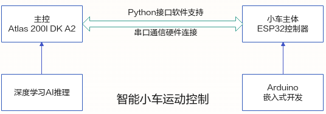
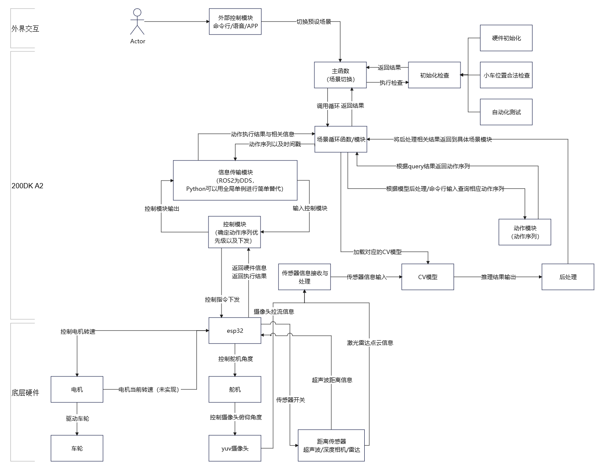

# 智能小车E2E样例Demo

## 1 功能与原理介绍
智能小车通过摄像头感知周围环境自主地进行运动控制，采集环境数据后在开发者套件上进行AI推理，根据推理结果发出指令控制小车的运动状态。小车运动状态的控制需要借助ESP32微控制器，使用Arduino平台可以对其进行嵌入式开发。主控与小车主体间控制指令的发出和数据的返回，需要通过串口协议进行双向通信。
智能小车从底层硬件到上层AI应用需要完成的任务。
- 了解智能小车的组成及部件原理
- 基于Arduino的硬件控制功能实现。
- 串口通信协议定义。
- ESP32硬件主程序设计。
- 开发者套件与ESP32进行指令通信的接口程序开发。
- AI推理应用开发。

主要实现原理如下：


小车协作图如下：


### 1.1 硬件部分

[小车机械结构组件](https://ascend-repo.obs.cn-east-2.myhuaweicloud.com/Atlas%20200I%20DK%20A2/DevKit/samples/23.0.RC1/e2e-samples/Car/E2E%E6%99%BA%E8%83%BD%E5%B0%8F%E8%BD%A6%E6%A0%B7%E4%BE%8B3D%E7%BB%93%E6%9E%84%E4%BB%B6.zip)


小车硬件部分准备和组装等步骤请依照智能车应用开发指南完成，本部分代码使用默认搭配已搭建完成的智能小车使用。

### 1.2 代码部分


本项目涉及智能小车控制底层代码，简单运动和复杂运动代码，各类工具以及多个推理模型，工程目录如下图所示：

```
Car
├── python
│   ├── main.py   #小车demo运行总入口
│   ├── requirements.txt #小车demo样例所需依赖
│   ├── src
│   │   ├── Lane-Follow-Train #循迹驾驶部分训练代码
│   │   ├── det_label_spilt #检测辅助分类模型
│   │   ├── actions
│   │   │   ├── base_action.py #小车基础运动代码
│   │   │   ├── complex_actions.py #小车复杂运动代码
│   │   │   └── __init__.py
│   │   ├── models
│   │   │   ├── bsae_model.py #基础模型
│   │   │   ├── det_cls.py #检测分类模型
│   │   │   ├── __init__.py
│   │   │   ├── lfnet.py #推理
│   │   │   └── yolov5.py #yolov5检测模型
│   │   ├── scenes  # 智能车预设场景相关代码
│   │   │   ├── base_scene.py 
│   │   │   ├── command.py
│   │   │   ├── helper.py
│   │   │   ├── __init__.py
│   │   │   ├── lane_following.py
│   │   │   ├── manual.py
│   │   │   └── tracking.py
│   │   └── utils #工具类python文件
│   │       ├── acl_utils.py
│   │       ├── camera_broadcaster.py
│   │       ├── common_utils.py
│   │       ├── constant.py
│   │       ├── controller.py
│   │       ├── cv_utils.py
│   │       ├── __init__.py
│   │       ├── init_utils.py
│   │       └── logger.py
│   └── weights #模型权重文件
└── 基于ESP32的智能小车控制
    ├── car_ctrl_esp32.ino
```

## 2 运行步骤

### 2.1 准备运行环境

下载智能车运行所需镜像

[镜像文件](https://ascend-repo.obs.cn-east-2.myhuaweicloud.com/Atlas%20200I%20DK%20A2/DevKit/images/23.0.RC1/1.1.0/A200I-DK-A2_e2e-samples-image_1.1.0_ubuntu22.04-aarch64.img.zip)
### 2.2 运行小车手动控制样例

将代码上传到智能车上车载DK后，进入到小车工作目录
```
cd /home/python

```
一键安装小车运行所需依赖
```
pip install -r requirements.txt
```

执行手动控制小车入口代码
```
python3 main.py
```
通过键盘输入手动控制小车移动
| 键位 | 动作        |
|----|-----------|
| w  | 前进        |
| a  | 后退        |
| s  | 左转        |
| d  | 右转        |
| q  | 逆时针旋转     |
| e  | 顺时针旋转     |
| ↑  | 加速        |
| ↓  | 减速        |
| c  | 捕获当前摄像头图片 |
| space  | 临时停车 |

### 2.2 运行小车自动驾驶与泊车样例
```
cd /home/python
```

执行自动驾驶小车入口代码
```
python3 main.py -mode==cmd
```
在命令行输入
```
Helper
```
加载转弯及停车辅助模型

在命令行输入
```
LF
```
加载直线矫正模型，小车开始自动驾驶，待行驶至停车标识处会自动进行泊车

 **注：若由于光线问题导致小车循迹驾驶部分效果不达预期，可以参照/Car/src/Lane-Follow-Train中的步骤说明标注并扩充数据集，再使用训练代码训练模型，训练后在./output中输出onnx模型，使用atc模型转换命令 ** 
```
atc --model=./lfnet.onnx --framework=5 --output=./out/lfnet --soc_version=Ascend310B1
```
**转换om模型文件，将./out/lfnet.om放入到Car/python/weights中，或替换原有循迹om模型即可。**

 **注： 若需要训练除停车标外的其他标识作为停车检测物，在使用[开发者套件模型适配工具](https://ascend-repo.obs.cn-east-2.myhuaweicloud.com/Atlas%20200I%20DK%20A2/DevKit/tools/23.0.RC1/1.1.3/Ascend-devkit-model-adapter_1.1.3_win-x86_64.exe)构建了检测部分模型后，参照det_label_split部分构建分类辅助模型，再转换om模型。** 

### 2.3 运行小车目标追踪样例
```
cd /home/python
```

执行自动驾驶小车入口代码
```
python3 main.py -mode==cmd
```
在命令行输入
```
Tracking
```
小车即可进入追踪模式

 **注：若需要重新训练不同停车标识或追踪目标，可以使用[开发者套件模型适配工具](https://ascend-repo.obs.cn-east-2.myhuaweicloud.com/Atlas%20200I%20DK%20A2/DevKit/tools/23.0.RC1/1.1.3/Ascend-devkit-model-adapter_1.1.3_win-x86_64.exe)构建目标检测应用。停车场景中检测+分类模型分别命名为'yolo.om'与'cls.om'并放入到Car/python/weights中;追踪模式的单检测模型命名为'tracking.om'并放入到Car/python/weights中做替换即可。** 


