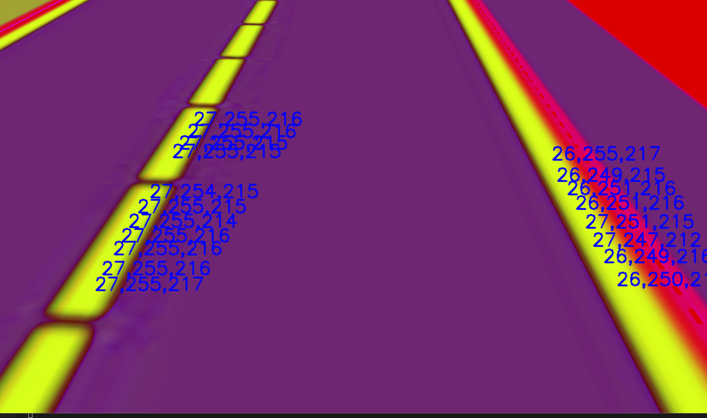

## 步骤

### 配置文件修改

前往工作目录`auto_label_tool`下，将采集好的数据放入，采集好的图片应全部放入一个文件夹中，将这个文件夹的路径配置到`config`目录下的`auto_label_setting.ini`中。

自动标注过程需要人工提取车道线的色域空间，因采集数据的光线可能有差，建议人工记录在不同光线下有代表性的图片，并将这些图片的路径逐一配置到`config`目录下的`hsv_file_setting.ini`文件中（具体见下一节）

### 获取车道线色域空间

我们先将一张图片的路径配置进`config`目录下的`hsv_file_setting.ini`文件，随后执行`python3 check_hsv.py`，在弹出的车道线画面中对道路线进行鼠标左键点击。效果如下：

建议将所有黄色车道线的部分尽可能多的用鼠标点击。

在一张图片结束后，切换输入法至英文，对着图片按任意键退出程序。

随后将下一张（可能车道线颜色因为光线原因和前一张略有不同）图片的路径配置进`config`目录下的`hsv_file_setting.ini`，重复上述步骤。

### 自动标注

执行`python main.py`即可

