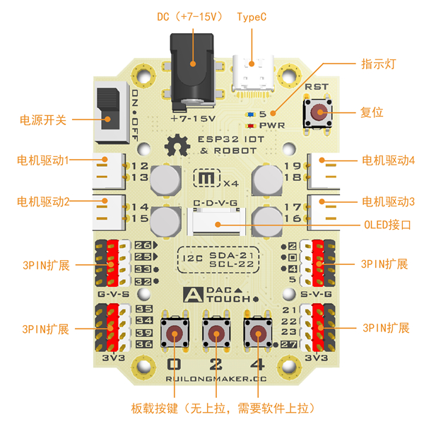
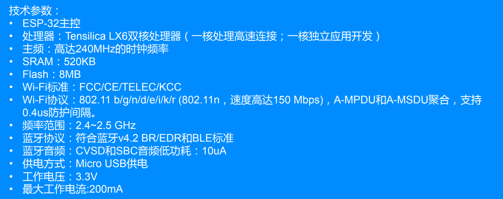
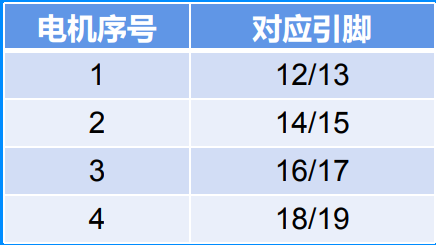
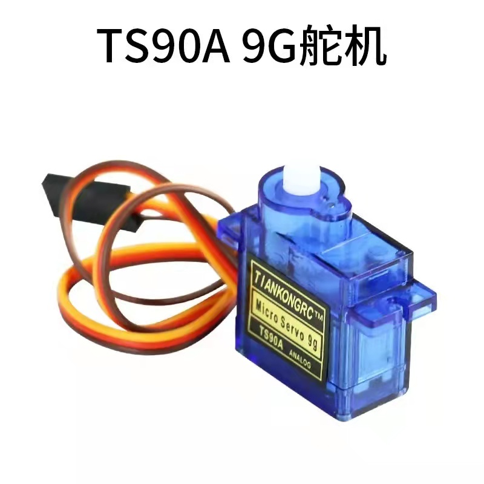
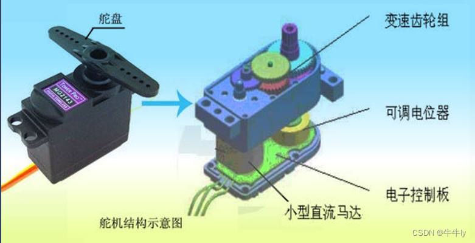
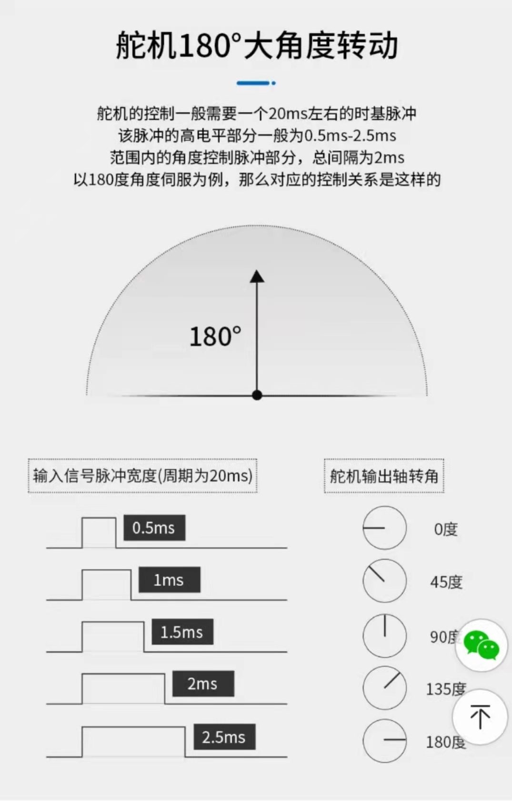
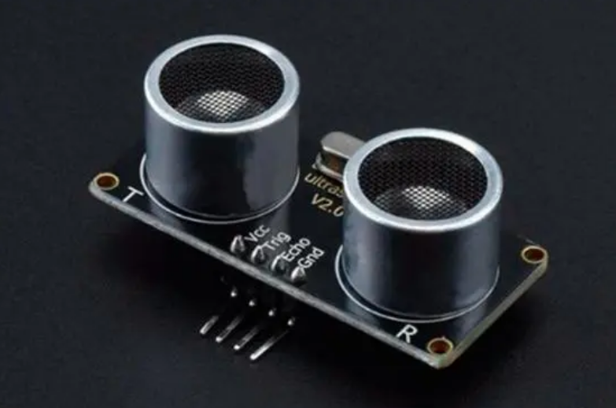
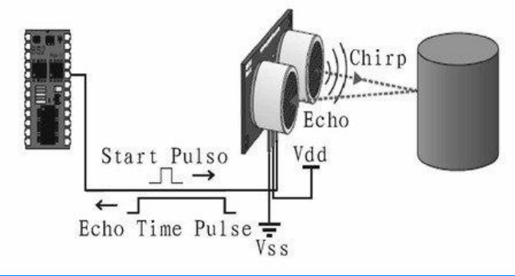

## 基于ESP32的智能小车控制

1. ### 小车的组成部分

   - **主控ESP32：**信号接收与发送，执行并调动其他部分完成指令；

   - **直流电机：**为小车提供动力；

   - **舵机：**执行器，装载摄像头，可控角度0~180°；

   - **超声波传感器：**可实现2~400cm的非接触距离感测功能，测距精度可以高达3mm；

   - **小车载板及电池：**载板提供支架，电池提供电源。

     

2. #### 主控ESP32

   ​		所使用的是ESP32 IOT&Robot Board （4Motor）物联网机器人开发板（4 电机），是一 款以 ESP-WROOM-32 为核心的物联网开发板，采用 ESP-WROOM-32 为主控。

   

   ​        如同其他单片机一样，本质上，ESP32就像一台微型计算机，能够处理数据和进行运算，最终通过引脚传递不同的电信号完成指令。通过不同引脚接入其他外设可以实现丰富的功能，更多详情及引脚定义可查看[官方文档](https://www.espressif.com.cn/zh-hans/products/socs/esp32)。

   ​        通过烧录控制程序可实现对外接传感器的感知和控制，常见的ESP32单片机程序编译工具有Arduino、Mixly、MicroPython等。

   

3. ### 直流电机及其控制

   - **电机的转动原理简单理解：**

     1个电机接2个引脚，当两个引脚分别接高低电平则开始以一定方向转动，电平相反则反方向转动，同为低或者高均不转动。

     注意：一般引脚的高电平为3.3V，通常不够驱动电机转动，需要5V左右电压可正常驱动轮子转动，故使用大电池给小车供电。

   - **电机转速控制：**

     控制电信号PWM波的占空比，占空比越大，说明周期内高电平持续时间越长，电机转速越快。

                               

   - **麦克纳姆轮原理及方向控制**

     如下图，我们只需调节4个电机的转动方向及速度即可实现小车的各种运动方式。

     

     

     - **示例代码**

     ```c++
     #include <RL_ESP32_Motor.h>
     // 定义电机引脚
     Motor Esp32_Motor_1(1,12,13);
     Motor Esp32_Motor_2(2,14,15);
     Motor Esp32_Motor_3(3,16,17);
     Motor Esp32_Motor_4(4,18,19);
     
     int speed; // 0~100
     // 小车前进
     void advance() {
       Esp32_Motor_1.Motor_Speed(speed);
       Esp32_Motor_2.Motor_Speed(speed);
       Esp32_Motor_3.Motor_Speed((-speed));
       Esp32_Motor_4.Motor_Speed((-speed));
     }
     // 小车后退
     void back() {
       Esp32_Motor_1.Motor_Speed((-speed));
       Esp32_Motor_2.Motor_Speed((-speed));
       Esp32_Motor_3.Motor_Speed(speed);
       Esp32_Motor_4.Motor_Speed(speed);
     }
     // 小车停止
     void stop() {
       Esp32_Motor_1.Motor_Speed(0);
       Esp32_Motor_2.Motor_Speed(0);
       Esp32_Motor_3.Motor_Speed(0);
       Esp32_Motor_4.Motor_Speed(0);
     }
     // 小车左转
     void left(float degree = 0.25) {
       Esp32_Motor_1.Motor_Speed(speed);
       Esp32_Motor_2.Motor_Speed(speed);
       Esp32_Motor_3.Motor_Speed((-speed * (1 + degree)));
       Esp32_Motor_4.Motor_Speed((-speed * (1 + degree)));
     }
     // 小车右转
     void right(float degree = 0.25) {
       Esp32_Motor_1.Motor_Speed(speed * (1 + degree));
       Esp32_Motor_2.Motor_Speed(speed * (1 + degree));
       Esp32_Motor_3.Motor_Speed((-speed));
       Esp32_Motor_4.Motor_Speed((-speed));
     }
     // 逆时针旋转
     void anticlockwise() {
       Esp32_Motor_1.Motor_Speed((-speed));
       Esp32_Motor_2.Motor_Speed((-speed));
       Esp32_Motor_3.Motor_Speed((-speed));
       Esp32_Motor_4.Motor_Speed((-speed));
     }
     // 顺时针旋转
     void clockwise() {
       Esp32_Motor_1.Motor_Speed((speed));
       Esp32_Motor_2.Motor_Speed((speed));
       Esp32_Motor_3.Motor_Speed((speed));
       Esp32_Motor_4.Motor_Speed((speed));
     }
     // 向左平移
     void left_tran() {
       Esp32_Motor_1.Motor_Speed((-speed));
       Esp32_Motor_2.Motor_Speed((speed));
       Esp32_Motor_3.Motor_Speed((speed));
       Esp32_Motor_4.Motor_Speed((-speed));
     }
     // 斜向左前方
     void left_oblique() {
       Esp32_Motor_1.Motor_Speed(0);
       Esp32_Motor_2.Motor_Speed((speed));
       Esp32_Motor_3.Motor_Speed(0);
       Esp32_Motor_4.Motor_Speed((-speed));
     }
     // 向右平移
     void right_tran() {
       Esp32_Motor_1.Motor_Speed((speed));
       Esp32_Motor_2.Motor_Speed((-speed));
       Esp32_Motor_3.Motor_Speed((-speed));
       Esp32_Motor_4.Motor_Speed((speed));
     }
     // 斜向右前方
     void right_oblique() {
       Esp32_Motor_1.Motor_Speed((speed));
       Esp32_Motor_2.Motor_Speed(0);
       Esp32_Motor_3.Motor_Speed((-speed));
       Esp32_Motor_4.Motor_Speed(0);
     }
     
     String messageIn;
     void setup(){
       Serial.begin(115200);
       speed = 75;
       Esp32_Motor_1.mcpwm_begin();
       Esp32_Motor_2.mcpwm_begin();
       Esp32_Motor_3.mcpwm_begin();
       Esp32_Motor_4.mcpwm_begin();
     }
     
     void loop(){
         if (Serial.available() > 0) //串口接收到数据
         {
             messageIn = Serial.readString();
             if (messageIn == "FASTER")
                 speed = speed + 10;
             else if (messageIn == "SLOWER")
                 speed = speed - 10;
             else if (messageIn == "ADVANCE")
                 advance();
             else if (messageIn == "BACK")
                 back();
             else if (messageIn == "STOP")
                 stop();
             else if (messageIn == "LEFT")
                 left();
             else if (messageIn == "RIGHT")
                 right();
             else if (messageIn == "LEFT_TRAN")
                 left_tran();
             else if (messageIn == "RIGHT_TRAN")
                 right_tran();
             else if (messageIn == "ANTICLOCKWISE")
                 anticlockwise();
             else if (messageIn == "CLOCKWISE")
                 clockwise();
             else if (messageIn == "LEFT_OBLIQUE")
                 left_oblique();
             else if (messageIn == "RIGHT_OBLIQUE")
                 right_oblique();
         }
     }
     ```

4. ### 舵机及其控制

   ​		舵机最早用于船舶上实现其转向功能，这就是舵机最早的由来。它是由直流电机、减速齿轮组、传感器(可变电阻）和控制电路组成的一套自动控制系统。

   

   - **与普通直流电机的区别**

   ​       直流电机是一圈圈转动的，舵机只能在一定角度内转动（有最大旋转角度比如：180度），不能一圈圈转。普通直流电机无法反馈转动的角度信息（如果带编码器就可以反馈角度），而舵机可以。用途也不同，普通直流电机一般是整圈转动做动力用，舵机是控制某物体转动一定角度用（比如机器人的关节）。

   - **舵机的控制原理**

   ​       舵机的输入线共有三条，红色是电源线，棕色是地线，这两根线给舵机提供最基本的能源保证，主要是电机的转动消耗。另外一根线是控制信号线，一般为桔黄色。

   ​		舵机的信号线是做为输入线就是接收PWM信号（定时器产生）。一般PWM的周期是20ms,那么对应的频率是50hz。那么改变不同的占空比就可以控制转动的角度。其中占空比从0.5~2.5ms，相对应的舵盘位置为0~180度，呈线性变化。

   

   - **示例代码**

     ```c++
     #include <ESP32_Servo.h>
     Servo servo_25;
     Servo servo_26;
     
     void setup(){
       servo_25.attach(25,500,2500);
       servo_26.attach(26,500,2500);
     }
     
     void loop(){
       servo_25.write(45);
       delay(100);
       servo_26.write(90);
     }
     ```

     

5. ### 超声波传感器

   - **超声波传感器原理**

   ​        由超声波发射探头发出的超声波脉冲，经媒质(空气)传到物体表面，反射后通过媒质(空气)传到接收探头，测定出超声脉冲从发射到接收所需的时间，根据传输媒质中的声速，计算从探头到物体表面之间的距离。

   ​		工作原理：

   - 采用IO口TRIG触发测距，给至少10us的高电平信号；
   - 模块自动发送8个40khz的方波，自动检测是否有信号返回；
   - 有信号返回，通过IO口ECHO输出一个高电平，高电平持续的时间就是超声波从发射到返回的时间；
   - 测试距离 = (高电平时间 * 声速(340M/S)) / 2。

   

   - **超声波测距示例代码**

     ```c++
     const int trigPin = 4;
     const int echoPin = 5;
     float distance;
     
     float checkDistance() {
       digitalWrite(trigPin, LOW); 
       delayMicroseconds(2);
       digitalWrite(trigPin, HIGH);
       delayMicroseconds(10);
       digitalWrite(trigPin, LOW);
     
       float distance = pulseIn(echoPin, HIGH) / 58.00;   //echo time conversion into a distance
       delay(10);
       return distance;
     }
     
     void setup()
     {
       Serial.begin(115200);
       pinMode(trigPin, OUTPUT);
       pinMode(echoPin, INPUT);
       distance = 0;
     }
     void loop()
     {
       distance = checkDistance();
       Serial.print(distance);
       Serial.println("cm");
       Serial.println();
       delay(1000);
     }
     ```

     

6. ### **串口实现Json数据通信**

   - **串口及连接方式**

   ​        串行接口简称串口，也称串行通信接口或串行通讯接口（通常指COM接口），是采用串行通信方式的扩展接口。串行接口 （Serial Interface）是指数据一位一位地顺序传送。其特点是通信线路简单，只要一对传输线就可以实现双向通信（可以直接利用电话线作为传输线），从而大大降低了成本，特别适用于远距离通信，但传送速度较慢。**利用串口，可以实现单片机之间、单片机与PC等其他设备之间的数据通信。**

   

   ​        设备与设备之间至少需要接三个线。`GND`是地线，提供低电平的参考电压。 接下来就是`RX` 信息接收端， 还有`TX` 信息发送端。 单片机A的`RX` 接单片机B的`TX`， 单片机B的`RX` 接单片机A的`TX`。若两个设备的VCC电压不一致，则也需相连。

   - **解析Arduino串口Json包**

   ​        Arduino封装了ESP32的串口库函数，可直接使用并自定义引脚为手法串口，需注意的是，选择的引脚必须是双向收发的GPI/O口，ESP32中有些引脚不支持双向收发I/O，则不可用。

   ​        注意，需安装Arduino_JSON包才可调用相关功能。自动生成Json解析和打包代码，使用ArduinoJson Assistant小工具：https://arduinojson.org/v6/assistant/#/step1。

   ```c++
   /*
   利用Arduino串口接收并解析如下格式Json数据：
   {
     "speed": [0/1/-1, 30],
     "carmove": ["STOP/ADVANCE/LEFT/...", 0.5],
     "servo": [45, 90],
     "checkdistance": 1
   }
   */
   
   #include <HardwareSerial.h>
   #include <ArduinoJson.h>
   
   String rx_buffer = ""; //声明字符串变量
   
   HardwareSerial mySerial1(1); // 自定义串口实例
   
   void setup()
   {
     mySerial1.begin(115200,SERIAL_8N1,32,33); // 初始化并自定义32，33引脚为串口    
   }
   
   void loop()
   {
     while (mySerial1.available() > 0) // 读取串口缓冲区的数据
     {
       rx_buffer += char(mySerial1.read());
       delay(2);
     }
   
     if (rx_buffer.length() > 0)
     {
       DynamicJsonDocument  jsonBuffer(400);
       deserializeJson(jsonBuffer, rx_buffer); // 解析Json数据
       JsonObject doc = jsonBuffer.as<JsonObject>();
   
       int speed_0 = doc["speed"][0]; // 0/1/-1
       int speed_1 = doc["speed"][1]; // 30
       const char* carmove = doc["carmove"][0]; // "STOP/ADVANCE/LEFT/..."
       float degree = doc["carmove"][1]; // 0.5
       int servo_0 = doc["servo"][0]; // 45
       int servo_1 = doc["servo"][1]; // 90
       int checkdistance = doc["checkdistance"]; // 1
   
       rx_buffer = "";
     }
   }
   ```

   

   - **ArdunioJson发送Json数据**

   ```c++
   /*
   利用ArduinoJson发送如下格式Json数据：
   {
     "speed": [0/1/-1, 30],
     "carmove": ["STOP/ADVANCE/LEFT/...", 0.5],
     "servo": [45, 90],
     "checkdistance": 1
   }
   */
   
   #include <ArduinoJson.h>
   void setup() {
     Serial.begin(115200);
     Serial.println("begin now");
   }
   
   void loop() {
      DynamicJsonDocument doc(256);
   
      JsonArray speed = doc.createNestedArray("speed");
      speed.add(0/1/-1);
      speed.add(100);
      doc["carmove"][0] = "STOP/ADVANCE/LEFT/...";
      doc["carmove"][1] = 0.5;
   
      JsonArray servo = doc.createNestedArray("servo");
      servo.add(45);
      servo.add(90);
      doc["checkdistance"] = 1;
      
      char json_string[256]; 
      serializeJson(doc, json_string); // 打包成Json串
      Serial.println(json_string); // 串口输出
   }
   ```

   

