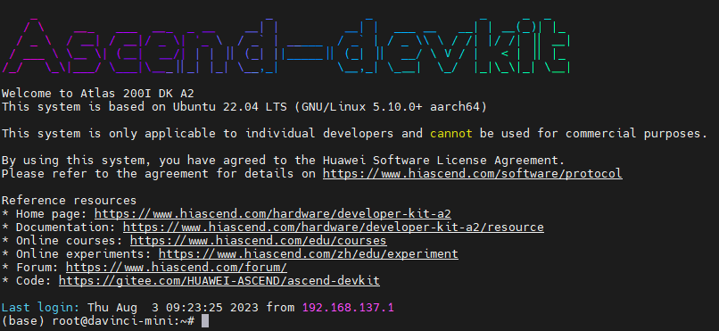

# ChatBot聊天机器人多用户DEMO 运行指南

相关资源的下载地址列表如下

| 资源名称                    | 下载地址                                                                                                                                                                                                                                                                                                     |
|:------------------------|:---------------------------------------------------------------------------------------------------------------------------------------------------------------------------------------------------------------------------------------------------------------------------------------------------------|
| models                  | [https://ascend-repo.obs.cn-east-2.myhuaweicloud.com/Atlas%20200I%20DK%20A2/DevKit/samples/23.0.RC1/e2e-samples/ChatBot/models.zip](https://ascend-repo.obs.cn-east-2.myhuaweicloud.com/Atlas%20200I%20DK%20A2/DevKit/samples/23.0.RC1/e2e-samples/ChatBot/models.zip)                                   |
| tokenizer_file          | [https://ascend-repo.obs.cn-east-2.myhuaweicloud.com/Atlas%20200I%20DK%20A2/DevKit/samples/23.0.RC1/e2e-samples/ChatBot/tokenizer_file.zip](https://ascend-repo.obs.cn-east-2.myhuaweicloud.com/Atlas%20200I%20DK%20A2/DevKit/samples/23.0.RC1/e2e-samples/ChatBot/tokenizer_file.zip)                   |

## 0.环境准备

**注意: 在4G版本的设备上运行时，需要挂载swap分区，否则可能会出现内存不足的情况。**

**注意：使用swap分区时如果开启了OOM Killer，内存将会在占用3.01G时进行swap分区交换，此时ChatBot的推理预热将会失效，在4G内存设备上使用本Demo请关闭OOM
killer，具体查询及关闭方式如下**

**注意： 以下提供针对两种版本的镜像的教程，请根据镜像版本选择对应的操作。旧版本镜像请执行 0.0流程与 0.1流程。新版本镜像请执行
0.2流程 与0.3流程。**

**新版本镜像ssh登录时有如下显示，如果显示界面为如下则为新版本镜像，否则为旧版本镜像**


### 0.0 关闭OOM Killer (旧版本镜像)

#### 0.0.1 使用root用户登录，在/etc/rc.local文件中删除或注释掉以下内容：

```shell 
echo 1 > /proc/sys/vm/enable_oom_killer
echo 0 > /sys/fs/cgroup/memory/usermemory/memory.oom_control
```

#### 0.0.2 修改/sys/fs/cgroup/memory/usermemory/memory.oom_control配置，这个操作是disable oom_killer

```shell
echo 1 > /sys/fs/cgroup/memory/usermemory/memory.oom_control
```

#### 0.0.3 在打开了内存控制的用户下，在~/.bashrc文件中将以下代码注释掉：

```shell
echo $$ > /sys/fs/cgroup/memory/usermemory/tasks
```

#### 0.0.4 重启系统

```shell
reboot
```

详细的关于开关OOM Killer的方式可以参考如下链接
[FAQ](https://gitee.com/HUAWEI-ASCEND/ascend-devkit/wikis/A200I%20DK%20A2/A200I%20DK%20A2%20%E9%95%9C%E5%83%8F%E7%89%B9%E6%AE%8A%E5%AE%9A%E5%88%B6%E6%93%8D%E4%BD%9C%E8%AF%B4%E6%98%8E)

### 0.1 挂载swap分区 (旧版本镜像)

**请在运行前提前挂载swap分区**

流程如下

### 0.1.1 通过free -h命令查看内存使用情况，如果内存总量小于4G，则需要挂载swap分区

```shell
free -h
```

### 0.1.2 申请一个2.5G的文件作为swap分区【推荐2.5G以上，请提前预留足够的空间】

```shell
sudo fallocate -l 2.5G /swapfile 
```

### 0.1.3 修改文件权限

```shell
sudo chmod 600 /swapfile
```

### 0.1.4 创建swap分区

```shell
sudo mkswap /swapfile
```

### 0.1.5 挂载swap分区

```shell
sudo swapon /swapfile
```

### 0.1.6 通过 free -h查看swap分区是否挂载成功

```shell
free -h
```

### 0.2 关闭OOM Killer (新版本镜像)

### 0.2.1 关闭OOM Killer服务

```shell
systemctl disable oom_killer
```

### 0.2.2 注释掉 ~/.bashrc文件中的以下内容

```shell
echo $$ > /sys/fs/cgroup/memory/usermemory/tasks
```

### 0.2.3 重启系统

```shell
reboot
```

### 0.3 关闭本地桌面(新版本镜像)

### 0.3.1 关闭本地桌面服务

```shell
systemctl disable toggle_graphical_desktop
```

### 0.3.2 重启系统

```shell
reboot
```

## 1.安装依赖

```shell
pip install -r requirements.txt
```

## 2.下载相关资源并放入对应目录

请将dist.zip、models.zip、tokenizer_file.zip解压后放入对应目录

## 3.运行DEMO

### 3.1 清除缓存

```shell
free -h && sudo sysctl -w vm.drop_caches=3 && sudo sync && echo 3 | sudo tee /proc/sys/vm/drop_caches && free -h
```

### 3.2 运行测试程序

```shell
python prepare.py
```

### 3.3 运行主程序

```shell
python main.py
```

## 4.获取命令行回显URL并在浏览器中打开

**当命令行回显ChatBot Ready时，表示初始化完成，DEMO运行成功**

**提示：在聊天框中输入clear可以清空聊天记录**

