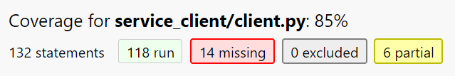
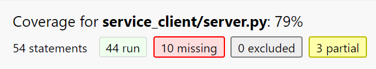

# 小藤HDMI分类场景推理样例

## 警告：尝试该样例将使包括但不限于"图形化界面"等功能失效，且无法恢复。该功能仅为高阶用户提供，请谨慎使用！！

#### 开发测试

本样例已对除ACL的部分进行了测试，测试覆盖率如下：

client部分：

server部分：

#### 使用方法

1. 请确保拥有一台Atlas 200I DK A2，并根据昇腾开发者套件文档，对一张SD卡完成基础镜像的制卡。完成制卡后，将SD卡插入小藤开发板的卡槽中。通过一条HDMI线，将显示屏与小藤的其中一个HDMI口进行连接。
2. 通过MobaXTerm软件登陆小藤，并在命令行中输入以下命令配置环境变量：`export LD_LIBRARY_PATH=/usr/local/Ascend/ascend-toolkit/latest/arm64-linux/lib64:/usr/local/Ascend/driver/lib64:$LD_LIBRARY_PATH`
3. 选择一个目录，使用`git clone`命令将代码仓下载至本地。并进入该文件夹，进入`hdmi_sample`目录，执行命令`make clean && make`进行编译。编译完成后，退出目录。
4. 创建一个ROS工作空间：`mkdir -p hdmi_infer_ws`。且将`git clone`命令中下载的`src`目录放置在`hdmi_infer_ws`目录中。
5. 在`hdmi_infer_ws`目录中完成使用`colcon build`命令。等待编译完成。
6. 在相同目录下，输入以下命令完成环境变量的配置：`source install/setup.bash`
7. 进入目录，`install/service_client/share/service_client/config`，对`hdmi_sample_image_folder.yaml`文件，根据注释完成配置。
8. 执行命令：`ros2 launch service_client hdmi_sample_image_folder.launch.py`。稍等片刻，即可看到图片在屏幕中完成显示。