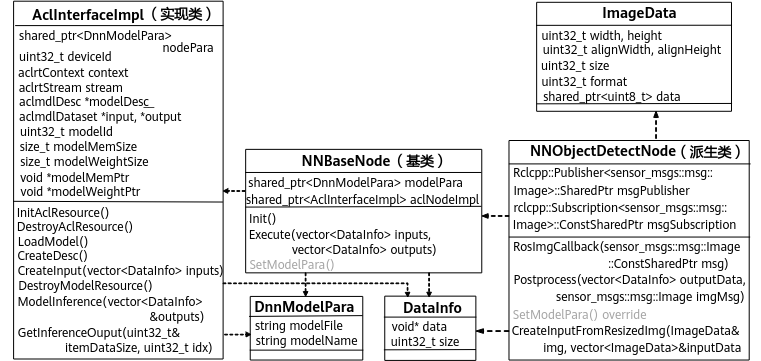
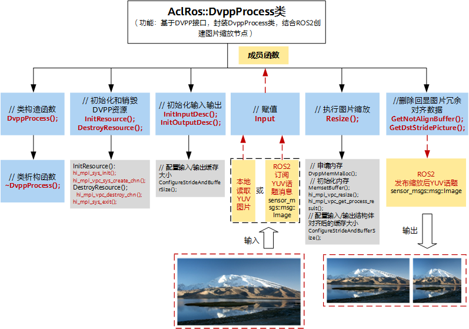

# 原理介绍

本章节针对提供的ROS2功能包范例，对如何基于ROS-AscendCL框架实现推理任务和媒体数据处理任务的原理分别进行了介绍。

## 推理任务的原理

基于ROS-AscendCL实现推理任务，其设计思想是将AscendCL中资源管理、模型推理相关的接口封装在一个基类里，用户通过继承该基类，在派生类中按推理流程逻辑去实现特定的推理任务，从而无需单独调用AscendCL的相关接口，推理任务的类实现如[图 推理任务的类实现图](#fig650343001216)所示，

**图 1**  推理任务的类实现图  

-   **基类NNBaseNode**：
    -   成员变量：定义了2个变量，modelPara是模型参数类DnnModelPara对象的指针，aclNodeImpl是AscendCL接口实现类AclInterfaceImpl对象的指针。
    -   成员方法：定义了3个方法，Init方法定义了AscendCL推理初始化流程，Execute方法定义了模型推理流程，SetModelPara方法负责设置模型推理的参数（如神经网络模型路径、模型名字等）。

-   **实现类AclInterfaceImpl：**

    一般与AscendCL推理相关的具体实现需要通过成员变量aclNodeImpl去调AscendCL的相关API（如aclInit、aclFinalize等）。

-   **派生类NNObjectDetectNode**：

    NNBaseNode是个抽象类，不能实例化，因为它包含纯虚函数SetModelPara，需要在派生类中定义具体的实现。因此，用户为了实现自己的推理任务需要定义一个派生类NNObjectDetectNode去继承基类。

    以目标检测为例，在派生类的相关成员方法中调用Init、Execute等基类方法，实现完整的模型推理过程，详细的代码示例请参见[目标检测样例代码](样例介绍.md#section17702104845315)。

在实现模型推理任务时，有两个过程需要关注：

-   **如何适配模型推理所需的数据**

    由于开发代码依赖的环境不同，所需的业务数据类型也就不同，有的是OpenCV的cv::Mat，有的是Python或C++标准库的数据结构，而AscendCL推理所用的离线模型（.om）支持的输入数据类型一般是yuv420sp格式，因此需要进行数据转换。此外，转换后的yuv420sp格式数据还需要根据模型推理所需的输入、输出格式和大小进行适配。

    [图 推理任务的类实现图](#fig650343001216)提供了DataInfo类，用于实现用户推理任务所需的数据转换，该类包含两个成员：数据存放地址data和数据大小size。

    -   在数据前处理阶段

        将接收到的数据转换成神经网络模型输入所需的数据类型，换言之将推理任务中的业务数据填充到类型为vector<DataInfo\>的模型输入中。

        比如在目标检测样例的NNObjectDetectNode类中，CreateModelInputFromResizedImage方法将待处理的ImageData类型图像数据按字节数填充到模型输入inputData中（把ImageData中的data赋值给DataInfo中的data）。

    -   在数据后处理阶段

        将神经网络模型推理的输出转换成任务所需的数据类型，换言之根据实际的数据类型把数据从类型为vector<DataInfo\>的模型输出中提取出来，进行后续处理。

        数据后处理的实现可参考目标检测样例中NNObjectDetectNode类的Postprocess方法。

-   **如何传递模型推理相关的参数**

    不同的推理任务需要不同的神经网络模型和不同的推理配置，这些参数一般在运行时通过读取配置文件加载到代码中。一个逻辑清晰、实现简单的参数透传方案对程序的鲁棒性、可扩展性、易维护性是很有帮助的。

    [图 推理任务的类实现图](#fig650343001216)中模型参数的传递过程如下：

    1.  派生类NNObjectDetectNode中SetModelPara方法将程序开始运行时从配置文件中读取的模型参数赋值给modelPara。
    2.  基类NNBaseNode的构造函数将modelPara作为参数去初始化aclNodeImpl成员变量时，实现类AclInterfaceImpl的构造函数就将modelPara赋值给类型为shared\_ptr<DnnModelPara\>的成员变量nodePara。

    > 于是，模型参数便从modelPara传递到了AscendCL接口实现类AclInterfaceImpl里，这样aclNodeImpl就能拿到模型参数去调用AscendCL的模型推理接口。事实上，开发者可以去扩展模型参数类DnnModelPara的成员，实现更丰富的参数配置。

基于ROS-AscendCL实现推理任务的过程是相对自由的，有较高的可定制化程度。开发者除了可以自由实现派生类NNObjectDetectNode去完成自己的推理任务外，还可以根据实际需要修改基类中的Init、Execute等方法实现。如果开发者对AscendCL接口不熟悉，建议不要修改基类的实现，直接在派生类的推理流程中调用基类方法即可。

## 媒体数据处理的原理

基于ROS-AscendCL实现媒体数据处理任务，其设计思想是基于AscendCL中DVPP V2接口并结合ROS2框架机制，封装DvppProcess类以构建媒体数据处理节点。DvppProcess类的实现过程与AscendCL中DVPP的VPC功能实现过程大致一样，具体请参考《应用软件开发指南（C&C++）》中“媒体数据处理V2 \> VPC图片处理典型功能 \> 接口调用流程”章节。

> **说明：** 
>相比于旧版数字视觉预处理接口（DVPP V1\)，使用DVPP V2能保证后续版本接口功能以及业务的连续演进，因此推荐使用 DVPP V2接口。

这里以图像缩放操作为例，DvppProcess类的具体实现如[图 DvppProcess类实现图](#fig1366495094011)所示，详细的代码示例请参见[图像缩放样例代码](样例介绍-0.md#section17702104845315)。

**图 2**  DvppProcess类实现图  

值得注意的是，DvppProcess类支持2种方式输入图片，分别是从本地读取YUV图像（.yuv）和订阅ROS2格式YUV图像话题消息（sensor\_msgs::msg::Image）。经过缩放后，图片的输出格式统一为ROS2格式YUV图像话题消息（sensor\_msgs::msg::Image）。

