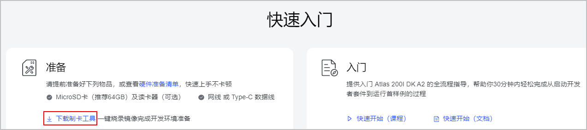
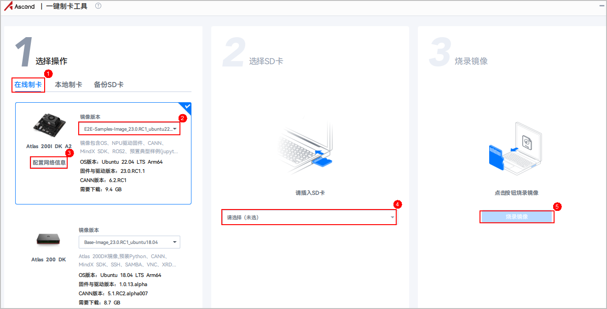
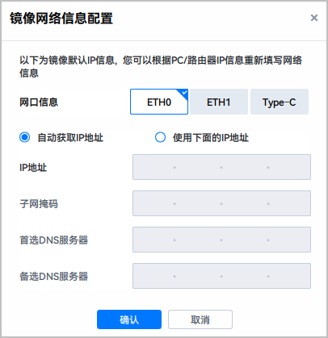

# 开发前准备

-   **硬件准备**：
    -   请提前准备好Atlas 200I DK A2开发者套件所需的相关硬件，具体请参考[硬件准备清单](https://www.hiascend.com/document/detail/zh/Atlas200IDKA2DeveloperKit/23.0.RC1/qs/qs_0001.html)。
    -   （可选）如果采用摄像头发布图像话题，请提前准备带USB接口的摄像头。

-   **软件准备**：

    使用ROS-AscendCL开发前，还需要准备相应的运行和开发环境，具体要求如[表 软件要求](#table12732542121016)所示。

    **表 1**  软件要求

    
    <table><thead align="left"><tr id="row973364221019"><th class="cellrowborder" valign="top" width="17.091709170917092%" id="mcps1.2.4.1.1">
配套组件

    </th>
    <th class="cellrowborder" valign="top" width="16.301630163016302%" id="mcps1.2.4.1.2">
版本要求

    </th>
    <th class="cellrowborder" valign="top" width="66.6066606660666%" id="mcps1.2.4.1.3">
安装说明

    </th>
    </tr>
    </thead>
    <tbody><tr id="row37338429104"><td class="cellrowborder" valign="top" width="17.091709170917092%" headers="mcps1.2.4.1.1 ">
板端操作系统

    </td>
    <td class="cellrowborder" valign="top" width="16.301630163016302%" headers="mcps1.2.4.1.2 ">
Ubuntu 22.04

    </td>
    <td class="cellrowborder" rowspan="3" valign="top" width="66.6066606660666%" headers="mcps1.2.4.1.3 ">
请使用Atlas 200I DK A2官网提供的<a href="https://www.hiascend.com/hardware/developer-kit-a2/resource" target="_blank" rel="noopener noreferrer">一键制卡工具</a>，将系统镜像一键烧录至SD卡中，镜像里已包含操作系统、CANN和ROS2软件包。<ol id="ol189331028141214"><li>单击“快速入门&gt;准备&gt;下载制卡工具”，下载软件至本地PC，直接双击运行“Ascend-devkit-imager_1.1.6_win-x86_64.exe”。

    </li><li>在弹出的“一键制卡工具”页面，参照如下步骤完成镜像烧录。

    

    <ol type="a" id="ol32251615114818"><li>选择制卡方式，推荐“在线制卡”。
 说明： 

如果本地PC无法连接外网，请选择“本地制卡”方式，提前下载镜像，再使用制卡工具将镜像烧录至SD卡。

    

    </li><li>选择镜像版本，建议选择“E2E-Samples-Image_23.0.RC1_ubuntu22.04”。</li><li>在线制卡时，需要保证PC能稳定访问网络。单击“配置网络信息”，根据实际情况填写网络信息。注意，带宽率建议在300Mbps以上。

    </li><li>选择待烧录的SD卡。</li><li>单击“烧录镜像”，等待一段时间，烧录成功。</li></ol>
    </li></ol>
    
 说明： 
<ul id="ul112044530272"><li>请注意，SD卡的存储空间至少64GB。</li><li>烧录镜像时会自动将SD卡格式化，请提前备份SD卡中的重要数据。</li></ul>
    

    

    </td>
    </tr>
    <tr id="row12733134231013"><td class="cellrowborder" valign="top" headers="mcps1.2.4.1.1 ">
CANN

    </td>
    <td class="cellrowborder" valign="top" headers="mcps1.2.4.1.2 ">
&gt;=6.2

    </td>
    </tr>
    <tr id="row13706201714264"><td class="cellrowborder" valign="top" headers="mcps1.2.4.1.1 ">
ROS2

    </td>
    <td class="cellrowborder" valign="top" headers="mcps1.2.4.1.2 ">
Humble

    </td>
    </tr>
    <tr id="row12658125854417"><td class="cellrowborder" valign="top" width="17.091709170917092%" headers="mcps1.2.4.1.1 ">
第三方依赖（可选）

    </td>
    <td class="cellrowborder" valign="top" width="16.301630163016302%" headers="mcps1.2.4.1.2 ">
OpenCV版本&gt;=4.5.4

    </td>
    <td class="cellrowborder" valign="top" width="66.6066606660666%" headers="mcps1.2.4.1.3 ">
在目标检测样例场景下（ros2_acl_inference），需要安装OpenCV。

    <ol id="ol1178885718538"><li>检查环境里是否已安装OpenCV，执行以下命令查询安装版本：<pre class="screen" id="screen187618384542">pkg-config opencv --modversion</pre>
    </li><li>若未安装OpenCV，执行如下命令安装：<pre class="screen" id="screen114042166582">sudo apt-get install libopencv-dev</pre>
    </li></ol>
    </td>
    </tr>
    </tbody>
    </table>

