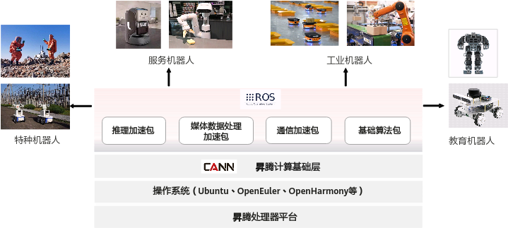

# 框架简介

ROS-AscendCL（Robot Operating System with Ascend Calculating Language）是一套面向ROS2的AscendCL推理框架，主要针对使用昇腾AI开发者套件（[Atlas 200I DK A2](https://www.hiascend.com/hardware/developer-kit-a2)）进行机器人AI应用开发的场景，整体架构如[图 ROS-AscendCL全栈图](#fig650343001216)所示。

**图 1**  ROS-AscendCL全栈图  

ROS-AscendCL本质是基于CANN AscendCL接口和ROS2 Node二次开发而来，为机器人应用开发提供了简单易用的AscendCL资源管理、模型推理相关的API。让机器人开发者不必去学习AscendCL接口的使用，也能利用昇腾AI处理器（Ascend 310B1）的强大算力进行AI推理加速，实现图像分类、目标检测、语义分割等众多机器人任务。

本手册针对推理和媒体数据处理两种典型场景，提供了基于ROS-AscendCL开发的ROS2功能包范例，帮助开发者加深对框架的理解和应用。

-   **[ros2\_acl\_inference功能包](推理任务样例（目标检测）.md)**：推理加速包（以目标检测为例），展示了如何基于ROS-AscendCL在ROS2里实现AI推理任务。
-   **[ros2\_dvpp2\_resize功能包](媒体数据处理样例（图像缩放）.md)**：媒体数据处理加速包（以图像缩放为例），展示了如何基于新版数字视觉预处理接口（DVPP V2）进行图像预处理，尤其是机器人场景中感知数据的处理。

