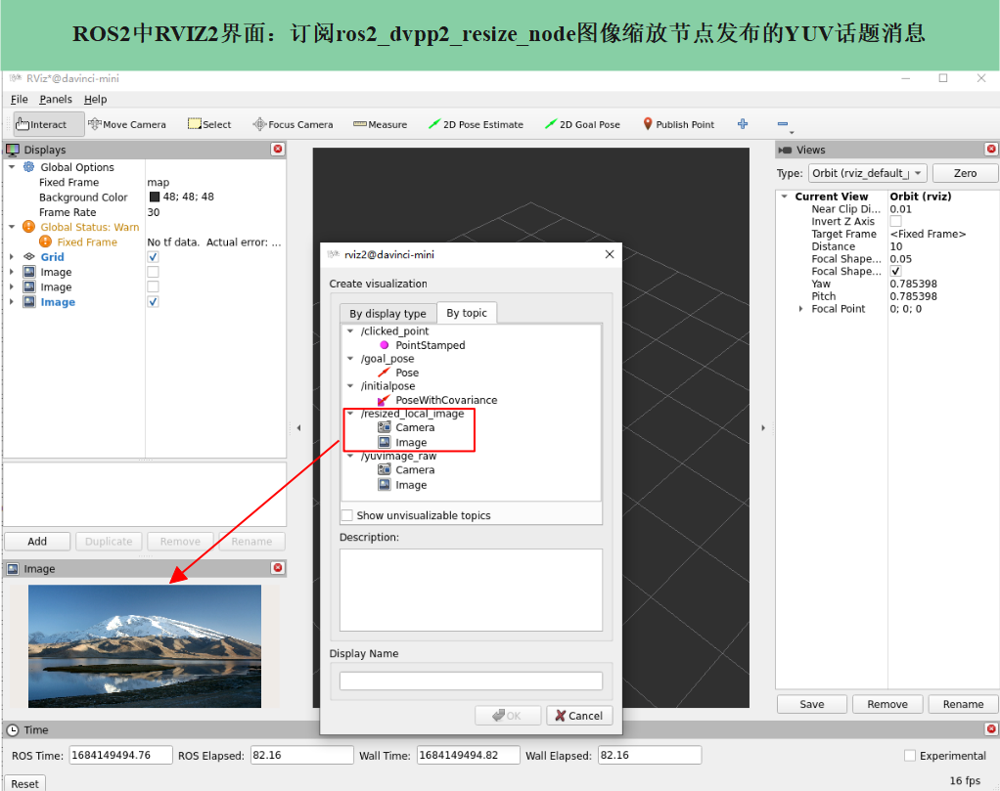

# 编译和运行<a name="ZH-CN_TOPIC_0000001532264186"></a>

请先阅读[表 ROS-AscendCL框架相关概念](基本概念.md#table2753105716549)，了解“ROS2功能包”的开发流程，按照如下步骤完成图像缩放功能包的编译和运行。

1.  创建工作空间。

    打开一个终端窗口，执行如下命令创建工作空间（以“ros2\_workspace\_dvpp”为例，可自定义），其中_$HOME_代表工作空间根目录。

    ```
    mkdir -p $HOME/ros2_workspace_dvpp/src    
    cd $HOME/ros2_workspace_dvpp
    colcon build    
    ```

2.  下载功能包代码。

    从[ROS-AscendCL代码仓](https://gitee.com/HUAWEI-ASCEND/ascend-devkit/tree/master/src/E2E-Sample/ROS-AscendCL)中下载图像缩放样例代码，即ros2\_dvpp2\_resize文件夹，并将该文件夹放到_$HOME_/ros2\_workspace\_dvpp/src目录下。

    如果使用git方式下载代码，可参考如下命令：

    ```
    git clone https://gitee.com/HUAWEI-ASCEND/ascend-devkit.git
    ```

3.  配置节点启动文件。
    1.  打开节点启动文件ros2\_dvpp2\_launch.py。

        ```
        vim $HOME/ros2_workspace_dvpp/src/ros2_dvpp2_resize/launch/ros2_dvpp2_launch.py
        ```

    2.  根据实际情况，修改图像发布节点和图像缩放节点的相关参数。

        ```
        from launch import LaunchDescription
        import launch_ros.actions
        
        def generate_launch_description():
            return LaunchDescription([
                launch_ros.actions.Node(
                    namespace="AclRos",
                    package='ros2_dvpp2_resize',
                    executable='ros2_dvpp2_resize_node', # 图像缩放节点名称
                    output='screen',
                    emulate_tty=True,
                    parameters=[
                                {"img_src_param": "LOCALIMG"},   # 图片输入模式，“LOCALIMG”表示从本地读取，“SUBMSG”表示订阅ROS2格式YUV图像消息。
                                {"pub_local_topic_name": "/resized_local_image"},    # 当输入模式为LOCALIMG，发布缩放图片话题的名称
                                {"pub_sub_topic_name": "/resized_submsg_image"},     # 当输入模式为SUBMSG，发布缩放图片话题的名称
                                {"sub_topic_name": "/yuvimage_raw"},        # 当输入模式为SUBMSG，订阅图像输入话题的名称   
                                # 当输入模式为LOCALIMG，读取图像的落盘地址  
                                {"yuvimg_file_name": "$HOME/ros2_workspace_dvpp/src/ros2_dvpp2_resize/data/dvpp_vpc_1920x1080_nv12.yuv"}, 
                                {"inputDataWidth": 1920},     # 缩放前，输入图像的宽
                                {"inputDataHeight": 1080},    # 缩放前，输入图像的高
                                {"outputDataWidth": 960},     # 缩放后，输出图像的宽
                                {"outputDataHeight": 540},    # 缩放后，输出图像的高
                                {"publish_interval": 500},    # 话题发布的时间间隔，单位是ms
                            ]
                ),
                launch_ros.actions.Node(
                    namespace="AclRos",
                    package='ros2_dvpp2_resize',
                    executable='publisher_yuvmsg_node', # 图像发布节点名称
                    output='screen',
                    emulate_tty=True,
                    parameters=[
                                {"pub_topic_name": "/yuvimage_raw"},  # 发布图像输入话题的名称
                                # 当输入模式为SUBMSG，读取图像的落盘地址
                                {"yuvimg_file_name": "$HOME/ros2_workspace_dvpp/src/ros2_dvpp2_resize/data/dvpp_vpc_1920x1080_nv12.yuv"},  
                                {"inputDataWidth": 1920},  # 输入的图像宽
                                {"inputDataHeight": 1080}, # 输入的图像高
                                {"publish_interval": 500}, # 话题发布的时间间隔，单位是ms
                            ]            
                )
            ])
        ```

4.  编译功能包，并配置环境变量。

    在ros2\_workspace\_dvpp文件夹下，执行如下命令，其中_$HUMBLE_代表ROS2 Humble版本安装目录，一般默认在/opt/ros/humble下。

    ```
    colcon build --packages-select ros2_dvpp2_resize
    source $HUMBLE/setup.bash
    ```

5.  运行功能包节点。
    -   方法1**（推荐）**：通过launch文件启动所有节点。

        ```
        ros2 launch ros2_dvpp2_resize $HOME/ros2_workspace_dvpp/src/ros2_dvpp2_resize/launch/ros2_dvpp2_launch.py
        ```

    -   方法2：通过ros2 run方式启动指定节点。

        > **说明：** 
        >当启动多个节点时，需要新启多个终端窗口分别执行命令。

        在ros2\_workspace\_dvpp文件夹下，执行如下命令，分别启动图像发布节点和图像缩放节点。

        ```
        ros2 run ros2_dvpp2_resize publisher_yuvmsg_node    
        ros2 run ros2_dvpp2_resize ros2_dvpp2_resize_node  
        ```

6.  查看运行结果。
    -   方法1：节点启动后，可直接在终端窗口查看ROS2消息收发、图像处理相关的打印信息。以launch文件运行为例：
        -   当launch文件中输入模式设为"LOCALIMG"，终端运行结果如下图所示：

            

        -   当launch文件中输入模式设为"SUBMSG"，终端运行结果如下图所示：

            

    -   方法2：通过ROS2自带的RViz2可视化工具查看图像缩放结果。
        1.  新启一个终端窗口，在界面输入命令“**rviz2**”，自动弹出工具界面。
        2.  单击工具界面左下方“Add”，在“By topic”菜单下选择/resized\_local\_image或者/resized\_submsg\_image话题，然后单击“OK”，可以在工具界面左下方查看缩放后的结果图。

            此处以输入模式为"SUBMSG"为例：

            


