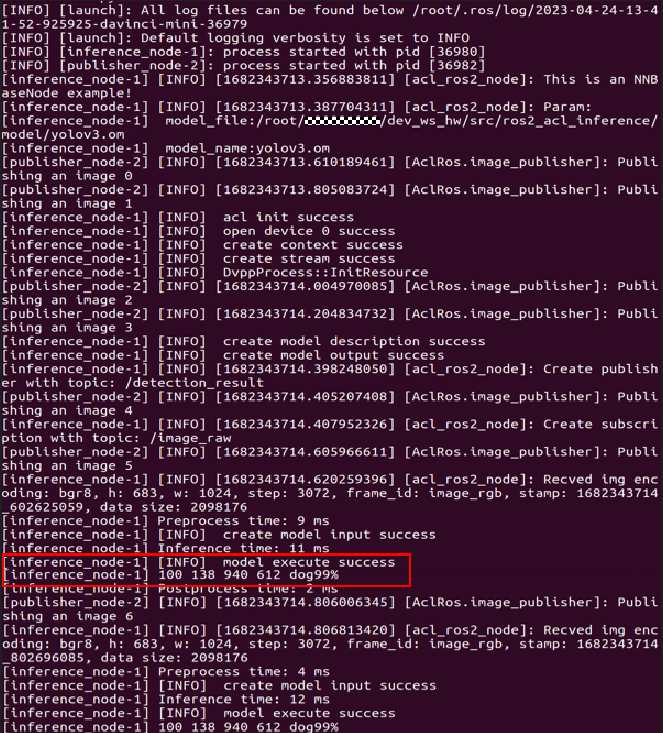
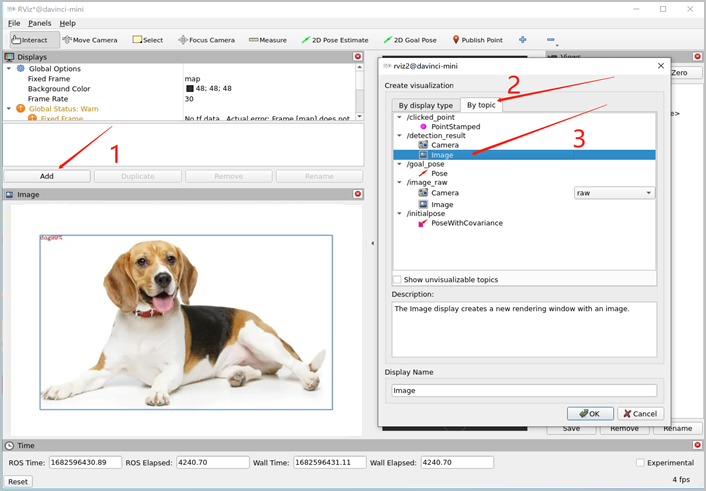

# 编译和运行<a name="ZH-CN_TOPIC_0000001531480446"></a>

在目标检测样例中，需要先启动摄像头发布节点，完成输入数据的采集，才能进行后续目标检测功能包的编译和运行。

## 摄像头发布节点启动<a name="section09176219557"></a>

1.  完成摄像头与板端（Atlas 200I DK A2开发者套件）物理连接。

    将摄像头USB接口与板端USB接口相连，并在板端Ubuntu终端运行“**Isusb**”命令，如果出现类似如下打印信息，则说明连接成功。

    此处以品牌为“xx”、型号为“C9xx”的摄像头为例：

    ```
    Bus 001 Device 002: ID 046d:085c xx, Inc. C9xx Pro Stream Webcam
    ```

2.  安装摄像头启动需要依赖的软件包。
    -   安装相关ROS2功能包：

        ```
        sudo apt install ros-humble-camera-calibration-parsers 
        sudo apt install ros-humble-camera-info-manager 
        sudo apt install ros-humble-launch-testing-ament-cmake
        ```

    -   安装ros2-cam驱动：

        ```
        sudo apt-get install ros-humble-usb-cam
        ```

    -   安装cv2：

        ```
        pip install opencv-python
        ```

3.  启动摄像头节点。

    执行如下命令，完成环境变量配置，并运行软件包中的摄像头启动文件。其中_$HUMBLE_代表ROS2 Humble版本安装目录，一般默认在/opt/ros/humble下。

    ```
    source $HUMBLE/setup.bash
    ros2 launch usb_cam $HUMBLE/share/usb_cam/launch/demo_launch.py
    ```

    执行如下命令，如果出现摄像头图像话题（/image\_raw）节点，则节点启动成功，否则启动失败。

    ```
    ros2 topic info topic_name
    ```

    节点启动成功后，一般会出现类似的打印信息，节点话题发布频率约30HZ左右。

    ```
    [usb_cam_node_exe-1] [INFO] [1682650739.270560029] [usb_cam]: Timer triggering every 33 ms
    ```


## 功能包编译和运行<a name="section155969306584"></a>

请先阅读[表 ROS-AscendCL框架相关概念](基本概念.md#table2753105716549)，了解“ROS2功能包”的开发流程，再按照如下步骤完成目标检测功能包的编译和运行。

1.  创建工作空间。

    打开一个终端窗口，执行如下命令创建工作空间（以“ros2\_workspace\_infer”为例，可自定义），其中_$HOME_代表工作空间根目录。

    ```
    mkdir -p $HOME/ros2_workspace_infer/src    
    cd $HOME/ros2_workspace_infer
    colcon build                         
    ```

2.  下载功能包代码。

    从[ROS-AscendCL代码仓](https://gitee.com/HUAWEI-ASCEND/ascend-devkit/tree/master/src/E2E-Sample/ROS-AscendCL)中下载目标检测样例代码，即ros2\_acl\_inference文件夹，并将该文件夹放到_$HOME_/ros2\_workspace\_infer/src 目录下。

    如果使用git方式下载代码，可参考如下命令：

    ```
    git clone https://gitee.com/HUAWEI-ASCEND/ascend-devkit.git
    ```

3.  下载yolov3.om模型。
    1.  在ros2\_acl\_inference文件夹下新建一个名为model的文件夹，用于存放模型文件。

        ```
        mkdir $HOME/ros2_workspace_infer/src/ros2_acl_inference/model       
        ```

    2.  单击[Link](https://ascend-repo.obs.cn-east-2.myhuaweicloud.com/Atlas%20200I%20DK%20A2/DevKit/models/23.0.RC1/cann/yolov3.om)可直接下载图像目标检测对应的yolov3.om文件，并放到model文件夹中。

4.  配置节点启动文件。
    1.  打开节点启动文件nodes\_launch.py。

        ```
        vim $HOME/ros2_workspace_infer/src/ros2_acl_inference/launch/nodes_launch.py
        ```

    2.  根据实际情况，修改模型推理节点相关参数。

        ```
        from launch import LaunchDescription
        import launch_ros.actions
        
        def generate_launch_description():
            return LaunchDescription([
                launch_ros.actions.Node(
                    namespace="AclRos", 
                    package='ros2_acl_inference', 
                    executable='inference_node', # 模型推理节点名称
                    output='screen',
                    emulate_tty=True,
                    parameters=[
                        {"model_file": "$HOME/ros2_workspace_infer/src/ros2_acl_inference/model/yolov3.om"}, # 网络模型的落盘地址
                        {"model_name": "yolov3.om"}, # 网络模型的名称
                        {"pub_topic_name": "/detection_result"}, # 发布目标检测结果话题的名称
                        {"sub_topic_name": "/image_raw"}, # 订阅图像输入话题的名称
                        {"modelWidth": 416}, # 网络模型的输入尺寸（宽）
                        {"modelHeight": 416} # 网络模型的输入尺寸（高）
                    ]
                ),
            ])
        ```

5.  编译功能包，并配置环境变量。

    在ros2\_workspace\_infer文件夹下，执行如下命令，其中_$HUMBLE_代表ROS2 Humble版本安装目录，一般默认在/opt/ros/humble下。

    ```
    colcon build --packages-select ros2_acl_inference
    source $HUMBLE/setup.bash
    ```

6.  运行功能包节点。
    -   方法1**（推荐）**：通过launch文件启动所有节点。

        ```
        ros2 launch ros2_acl_inference $HOME/ros2_workspace_infer/src/ros2_acl_inference/launch/nodes_launch.py
        ```

    -   方法2：通过ros2 run方式启动指定节点。

        > **说明：** 
        >当启动多个节点时，需要新启多个终端窗口分别执行命令。

        ```
        ros2 run ros2_acl_inference inference_node    
        ```

7.  查看运行结果。
    -   方法1：节点启动后，可直接在终端窗口查看ROS2消息收发、图像处理、模型推理相关的打印信息。

        

    -   方法2：通过ROS2自带的RViz2可视化工具查看目标检测结果。
        1.  新启一个终端窗口，在界面输入命令“**rviz2**”，自动弹出工具界面。
        2.  单击工具界面左下方“Add”，在“By topic”菜单下选择/detection\_result话题，然后单击“OK”，可以在工具界面左下方查看目标检测的结果图。

            


