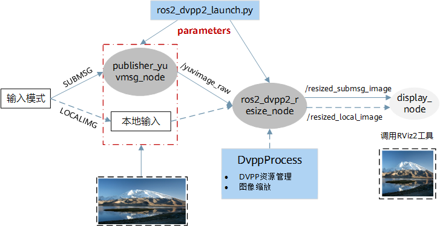

# 调用流程

## 接口调用流程

基于ROS-AscendCL实现图像缩放时，DvppProcess类中核心调用的是DVPP V2的resize接口，详细的调用流程如[图 图像缩放样例中DVPP调用流程](#fig1793310719)所示。

**图 1**  图像缩放样例中DVPP调用流程  

## 节点调用流程

图像缩放功能包（ros2\_dvpp2\_resize）定义了图像发布节点publisher\_yuvmsg\_node和图像缩放节点ros2\_dvpp2\_resize\_node，前者用于发布ROS2格式图像话题消息，后者用于实现缩放操作。如需验证图像缩放节点的输出，可增加可视化节点display\_node。节点间详细的调用流程如[图 图像缩放样例节点图](#fig25871140131211)所示。

**图 2**  图像缩放样例节点图  

-   **当输入模式为LOCALIMG：从本地读取YUV图像（.yuv）**
    1.  ros2\_dvpp2\_resize\_node：从本地读取YUV图片，图片缩放后将结果以ROS msg形式发布到/resized\_local\_image话题上，供下游任务处理。
    2.  （可选）display \_node：通过订阅/resized\_local\_image话题获取缩放结果，并基于ROS2中RViz2工具进行可视化呈现。

-   **当输入模式为SUBMSG：发布ROS2格式YUV图像话题消息（sensor\_msgs::msg::Image）**
    1.  publisher\_yuvmsg\_node：将采集的图像数据按一定帧率以ROS msg形式发布到/yuvimage\_raw话题上。
    2.  ros2\_dvpp2\_resize\_node：通过订阅/yuvimage\_raw话题获取输入图片，图片缩放后将结果以ROS msg形式发布到/resized\_submsg\_image话题上，供下游任务处理。
    3.  （可选）display \_node：通过订阅/resized\_submsg\_image话题获取缩放结果，并基于ROS2中RViz2工具进行可视化呈现。

