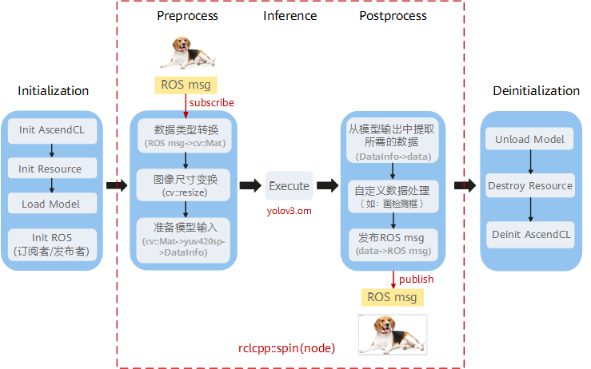
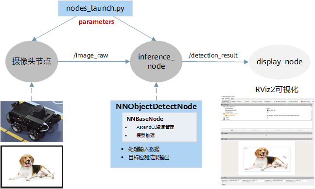

# 调用流程

## 接口调用流程

基于ROS-AscendCL实现图像目标检测时，主要的调用流程如[图 目标检测样例流程图](#fig19733194691712)所示。

**图 1**  目标检测样例流程图  

1.  初始化：
    1.  使用AscendCL接口前，必须先进行AscendCL初始化，否则会导致接口无法正常使用。
    2.  资源初始化。申请运行所需的管理资源，如device、context等。
    3.  加载模型。加载用于目标检测的模型文件，必须是适配昇腾AI处理器的离线模型（\*.om文件）。
    4.  ROS2资源初始化。创建话题的发布节点和订阅节点，方便消息在节点间传递。

2.  预处理：
    1.  订阅摄像头发布的图像话题，获取ROS msg格式图片，并转换为cv::Mat格式。
    2.  调用OpenCV自带的resize接口，对图片进行尺寸变换。
    3.  根据模型需要的输入构建所需的数据格式。

3.  推理：调用父类Execute方法进行目标检测。
4.  后处理：
    1.  根据实际任务所需的数据类型，从模型的输出中提取所需的数据。
    2.  自定义后处理逻辑，如绘制检测框。
    3.  发布目标检测结果的图像话题。

5.  去初始化：依次进行模型卸载、运行管理资源释放、AscendCL去初始化。

## 节点调用流程

目标检测功能包（ros2\_acl\_inference）定义了一个模型推理节点inference\_node，主要用于接收摄像头发布的图像话题消息，实现推理任务。如需验证推理节点的输出，可增加可视化节点display\_node。节点间详细的调用流程如[图 目标检测样例节点图](#fig650343001216)所示。

**图 2**  目标检测样例节点图  

1.  摄像头节点：板端连接的摄像头先采集图像数据，并按一定帧率以ROS msg形式发布到/image\_raw话题上。
2.  inference\_node：通过订阅/image\_raw话题获取输入图片，经过预处理后进行模型推理，再将推理结果以ROS msg形式发布到/detection\_result话题上，供下游任务处理。
3.  （可选）dispaly\_node：通过订阅/detection\_result话题获取推理结果，并基于ROS2中RViz2工具进行可视化呈现。

