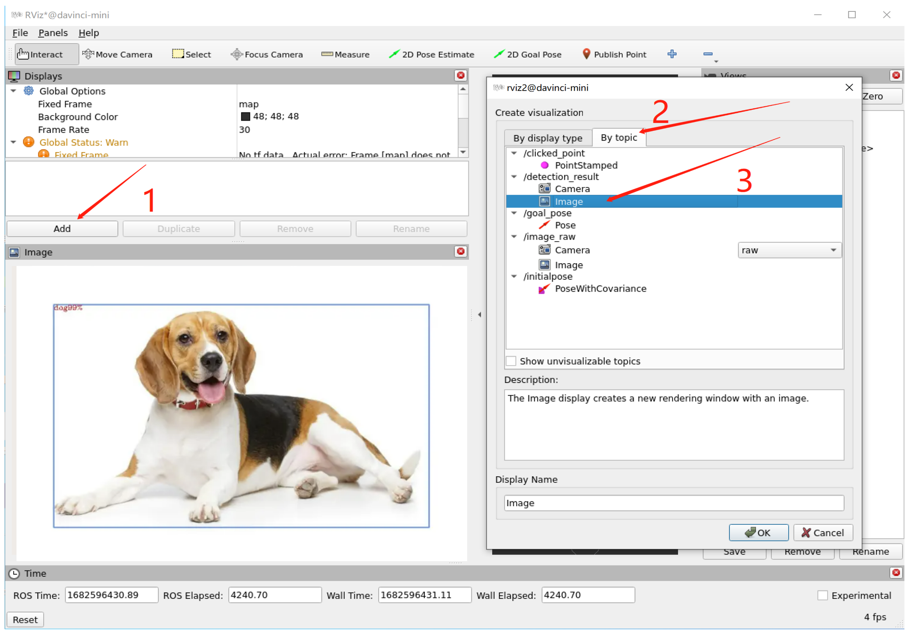

# ROS-ACL：面向ROS2的AscendCL推理框架

## __1. 功能介绍__

ROS-ACL是针对昇腾AI开发者套件[Atlas 200I DK A2](https://www.hiascend.com/hardware/developer-kit-a2)的板端AI推理框架，基于CANN AscendCL接口和ROS2 Node进行二次开发，为机器人应用开发提供简单易用的调用接口和实践范例，让开发者能快速在Atlas 200I DK A2上利用Ascend 310A2 AI处理器的强大算力和图像处理能力实现图像分类、物体检测等AI功能。

本代码仓是ROS Package的形式，可在板端ROS2工作空间中直接编译运行。它包含一个模型推理节点inference_node。usb摄像头按一定帧率以ROS msg的形式发布/image_raw图像话题；inference_node订阅/image_raw话题，对接收到的图像做推理，并将结果以ROS msg的形式发布（供下游任务处理）。

代码主要包含两部分内容：

- AscendCL推理基类NNBaseNode：将推理应用中涉及到的AscendCL初始化/去初始化、运行管理资源申请/释放、模型推理等公共步骤进行封装。

- 用户派生类NNObjectDetectionNode：以目标检测应用为样例，通过继承NNBaseNode类，添加参数配置和对模型输入输出的处理，实现完整的推理任务。

整个图像目标检测功能包的节点分布图如下所示：
 

&nbsp;

## __2. 目录结构__

图像检测样例代码结构如下所示。

```
├── include
│   ├── AclInterfaceImpl.h       // ACL推理实现类声明文件
│   ├── NNBaseNode.h             // ACL推理流程虚基类声明头文件
│   ├── NNObjectDetectNode.h                     // 目标检测子类声明头文件
│   ├── Utils.h                  // 功能函数声明头文件

├── launch
│   ├── nodes_launch.py          // 用于启动多个节点和配置节点参数的launch文件

├── src
│   ├── AclInterfaceImpl.cpp     // ACL推理实现类实现源文件
│   ├── DetectionExample.cpp     // 目标检测样例推理节点源文件
│   ├── NNBaseNode.cpp           // ACL推理流程虚基类实现源文件
│   ├── NNObjectDetectNode.cpp   // 目标检测子类实现源文件
│   ├── Utils.cpp                // 功能函数实现源文件

├── CMakeLists.txt               // ROS2功能包编译脚本
├── package.xml                  // 配置文件，添加节点依赖项
├── readme.md                    // 说明文件，包含代码逻辑及运行说明
```
目标检测功能包代码一共包含5个模块，分别是基础代码、派生类代码、工具类代码、节点源代码、节点启动代码，代码中涉及的关键API介绍可以参考[ROS-AscendCL开发指南中 目标检测样例API](https://gitee.com/HUAWEI-ASCEND/ascend-devkit/tree/master/src/E2E-Sample/ROS-AscendCL/ROS-AscendCL%E5%BC%80%E5%8F%91%E6%8C%87%E5%8D%97)。

- 基础代码：包括基类和AscendCL接口实现类代码，即NNBaseNode.h、AclInterfaceImpl.h、NNBaseNode.cpp、AclInterfaceImpl.cpp。

    （如果开发者不熟悉AscendCL接口，建议不要修改基础代码，下载代码后直接在样例中编译和运行即可。）
- 派生类代码：实现模型推理过程的核心代码，即NNObjectDetectNode.h、NNObjectDetectNode.cpp。
- 工具类代码：实现公共功能的函数，即Utils.h、Utils.cpp。
- 节点源代码：ROS2节点的入口代码，即DetectionExample.cpp
- 节点启动代码：nodes_launch.py。

    launch文件定义了待启动的ROS2节点，还有推理任务相关的参数（如模型路径、模型名称、输入/输出数据大小等）。开发者需根据自身实际情况，自行删减或修改相关参数，并同步在源代码的参数声明和使用的地方适配。

&nbsp;

## __3. 前置条件__

ROS-ACL是面向开发者用Atlas 200I DK A2做机器人AI应用开发的，使用前需先将特定的系统镜像烧录至SD卡，详细制卡操作请参考[制卡教程](https://www.hiascend.com/hardware/developer-kit-a2/resource)。使用本代码仓前请检查以下环境条件是否满足，如不满足请按照备注进行相应处理。
| 配套组件 | 版本要求 | 安装说明 |
|---|---|---|
| 板端操作系统操作系统 | Ubuntu 22.04 | 请使用Atlas 200I DK A2官网提供的[一键制卡工具](https://www.hiascend.com/hardware/developer-kit-a2/resource)，将系统镜像一键烧录至SD卡中，镜像里已包含操作系统、CANN和ROS2软件包。<br> (1) 单击“快速入门>准备>下载制卡工具”，下载软件至本地PC，直接双击运行“Ascend-devkit-imager_1.1.6_win-x86_64.exe” <br> (2) 在弹出的“一键制卡工具”页面，完成镜像烧录 <br> a. 选择制卡方式，推荐“在线制卡” <br> b. 选择镜像版本，建议选择“E2E-Samples-Image_23.0.RC1_ubuntu22.04” <br> c. 在线制卡时，需要保证PC能稳定访问网络。单击“配置网络信息”，根据实际情况填写网络信息。注意，带宽率建议在300Mbps以上 <br> d. 选择待烧录的SD卡（内存最好>=64GB） <br> e. 单击“烧录镜像”，等待一段时间，烧录成功 |
| CANN | >=6.2 | SD卡的系统镜像中已预装CANN，注意固件与驱动版本 |
| ROS2 | Humble | SD卡的系统镜像中已预装ROS2-Humble |
| 第三方依赖 | OpenCV 4.5.4 | 在目标检测样例场景下（ros2_acl_inference），需要安装OpenCV。<br>检查环境里是否已安装OpenCV，执行以下命令查询安装版本：<br>```pkg-config opencv --modversion```<br>若未安装OpenCV，执行如下命令安装：<br>```sudo apt-get install libopencv-dev``` |


&nbsp;

## __4. 样例运行__

首先需要确认ros2-humble的环境变量是否配置好（humble版本的ROS2安装目录，一般默认在/opt/ros/humble下，如果不是，请修改至自己设置的目录下），执行下面的两行指令；第一行指令是使当前终端窗口的ro2配置生效，第二行指令是为了新打开终端窗口，ros2环境变量配置自动生效。
```
$ source /opt/ros/humble/setup.bash
$ echo " source /opt/ros/humble/setup.bash" >> ~/.bashrc 
```

执行完上面两个指令后，在终端窗口内键入ros2这四个字符，然后点击回车，如果出现类似如下打印信息，就说明ros2配置成功：
```
usage: ros2 [-h] [--use-python-default-buffering] Call `ros2 <command> -h` for more detailed usage. ...

ros2 is an extensible command-line tool for ROS 2.

Commands:
  action     Various action related sub-commands
  bag        Various rosbag related sub-commands
......
```

### 4.1. 摄像头发布节点启动

（1）连接usb摄像头

将摄像头的usb接头插到Atlas 200I DK A2板端的usb接头上。

（2）查看usb摄像头是否连接成功

在板端ubuntu终端运行lsusb指令，当出现类似如下打印信息，即可说明连接成功
```
Bus 001 Device 002: ID 046d:085c Logitech, Inc. C922 Pro Stream Webcam
```
（3）安装ros2下摄像头启动需要的依赖
- 安装相关功能包
```
sudo apt install ros-humble-camera-calibration-parsers
sudo apt install ros-humble-camera-info-manager
sudo apt install ros-humble-launch-testing-ament-cmake
```
- ros2-cam驱动安装
```
sudo apt-get install ros-humble-usb-cam
```
- cv2安装
```
pip install opencv-python
```
（4）启动摄像头节点
```
ros2 launch usb_cam demo_launch.py
```
看到类似如下信息打印，即可说明摄像头图像话题（/image_raw）发布节点启动成功，节点话题发布频率为30hz左右（注意：启动摄像头之后保持开启状态，即当前终端窗口不进行其他操作，以保持摄像头发布节点的正常持续运行）。
```
[usb_cam_node_exe-1] [INFO] [1682650739.270560029] [usb_cam]: Timer triggering every 33 ms
```

### 4.2. ros2_acl_inference图像目标检测节点启动

（1）创建工作空间
```
mkdir -p $HOME/dev_ws/src
```
其中，\$HOME代表工作空间的根目录。

（2）创建功能包

进入到$HOME/dev_ws/src文件夹，从代码仓里面下载ros2_acl_inference目录下样例代码。
```
git clone https://gitee.com/HUAWEI-ASCEND/ascend-devkit.git
```
从上一步git clone下来的文件夹中，进入“ascend-devkit/src/E2E-Sample/ROS-AscendCL”目录，找到ros2_acl_inference文件夹，然后移动到$HOME/dev_ws/src目录下（$HOME/dev_ws/src及其子文件中不能同时存在多个文件夹同名的功能包文件，否则会报错，因此需要进行移动操作，而不是复制操作）。


（3）下载yolov3.om模型文件

进入ros2_acl_inference文件夹，新建一个名为model文件夹，通过以下网址直接下载图像目标检测对应的.om文件，放入model文件夹中，网址如下所示：
```
https://ascend-repo.obs.cn-east-2.myhuaweicloud.com/Atlas%20200I%20DK%20A2/DevKit/models/23.0.RC1/cann/yolov3.om
```

（4）rosdep检查依赖安装完整性
```
rosdep install -i --from-path src --rosdistro humble -y
```

（5）回退到$HOME/dev_ws主文件夹，colcon编译功能包

在launch/nodes_launch.py中配置图像发布节点和模型推理节点的相关参数，请参考[功能包编译和运行4.2.](https://gitee.com/HUAWEI-ASCEND/ascend-devkit/blob/master/src/E2E-Sample/ROS-AscendCL/ROS-AscendCL%E5%BC%80%E5%8F%91%E6%8C%87%E5%8D%97/context/%E7%BC%96%E8%AF%91%E5%92%8C%E8%BF%90%E8%A1%8C.md#%E5%8A%9F%E8%83%BD%E5%8C%85%E7%BC%96%E8%AF%91%E5%92%8C%E8%BF%90%E8%A1%8C)，然后执行以下指令：
```
colcon build --packages-select ros2_acl_inference
```

（6）打开新终端，需要首先进入$HOME/dev_ws目录下，执行以下两行指令（不需要其它配置操作）；第一行指令是配置工作空间的环境变量，第二行指令是运行launch文件，启动inference_node图像目标检测节点。（备注：如果修改了nodes_launch.py文件或者其他代码文件，需要重新执行(5)中的编译功能包指令，再执行下面的指令。）
```
source install/setup.bash
ros2 launch ros2_acl_inference nodes_launch.py
```

&nbsp;

## __5. 查看图像目标检测结果__

节点启动后，可在终端看到ROS消息收发、图像处理、模型推理相关的打印信息。另外可另开新的终端打开rviz2，通过添加/detection_result话题查看目标检测的结果。操作步骤如下所示：

打开一个新终端，键入如下rviz2指令，即可打开rviz2界面
```
rviz2
```

然后点击左下角的Add按钮，然后选择By topic，找到/detection_result话题中的image，就可以看到实时图像目标检测的画面，左上角带框和相似度百分比的，如下所示。

 

&nbsp;

## __6. 注意事项__

### 6.1. 功能包节点启动
可以通过ros2 run的方式启动模型推理节点，但需要在节点对应cpp源代码中将launch文件里对应的参数配置好；

### 6.2. CANN、AscendCL等相关问题定位
如果在安装、编译、运行过程中遇到CANN、AscendCL等相关问题，可参考[常见问题定位](https://gitee.com/ascend/samples/wikis/%E5%B8%B8%E8%A7%81%E9%97%AE%E9%A2%98%E5%AE%9A%E4%BD%8D/%E4%BB%8B%E7%BB%8D)；

&nbsp;

## __7. 常见问题__
### 7.1. 执行ros2指令时提示找不到该指令。
- 问题描述

    在终端窗口输入ros2 xxx指令时（比如创建功能包、运行功能包节点等场景），出现如下提示：
    -bash: ros2: command not found
- 可能的原因

    终端窗口中没有设置ros2工作空间的环境变量，尤其是新启一个终端窗口的场景。
- 处理方案

    运行用户在终端窗口执行如下命令，使ros2环境变量生效，其中\$HUMBLE 代表humble版本的ROS2安装目录，一般默认在/opt/ros/humble下。
    ```
    source $HUMBLE/setup.bash
    ```

### 7.2. 节点话题的订阅或发布出现失败的情况。
- 问题描述

    功能包中的节点收发话题（topic）消息失败，出现订阅节点一直处于等待消息的状态。

- 可能的原因

    在修改样例代码过程中，引入了一些错误，导致功能包中的部分节点未成功启动。
    例如节点的话题名称被改动了，其他节点对应的接收话题名称没有同步修改。

- 处理方案

    (1) 检查发布和订阅端是否都成功启动。执行如下命令，查看MD5值是否一致。
    ```
    ros2 topic info topic_name
    ```

    (2) 检查同一个话题是否存在多个发布端。如果存在多个发布端，后启动的发布节点是不会生效的，请避免该情况发生。

    (3) 检查订阅端queue size取值是否合理。一般queue size取值建议2及以上，如果queue size=1，可能会导致无实际缓存可用。
