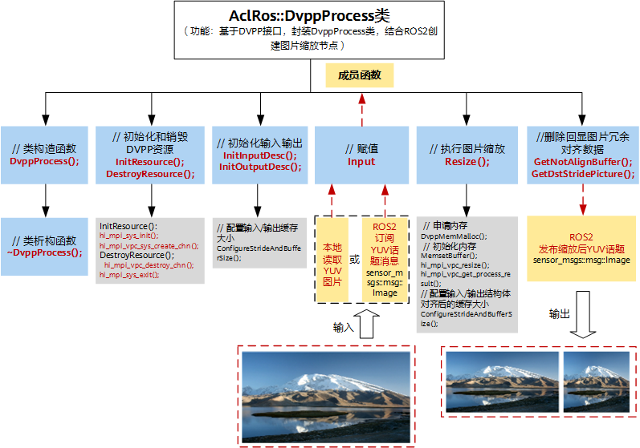
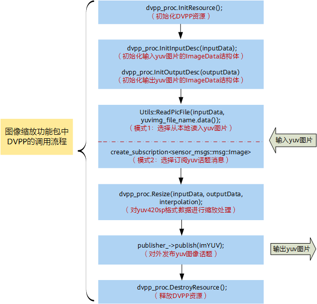
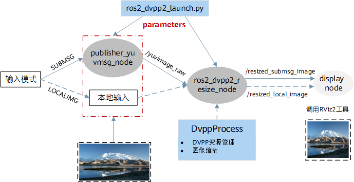
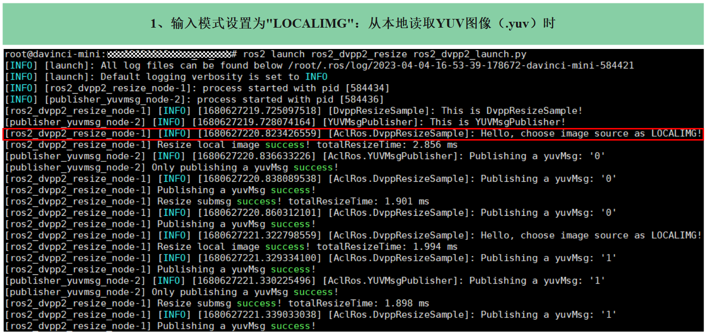
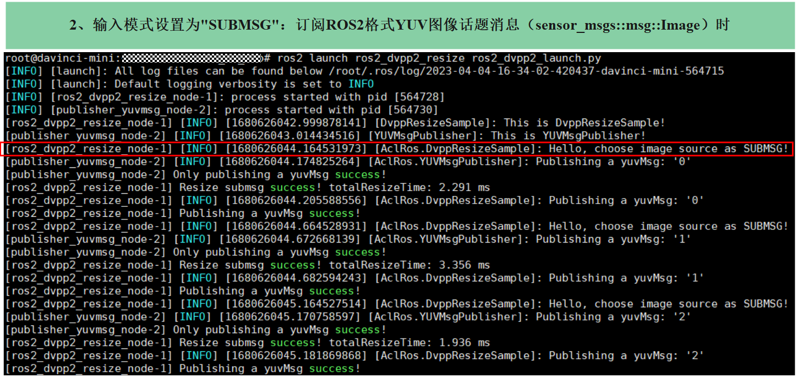
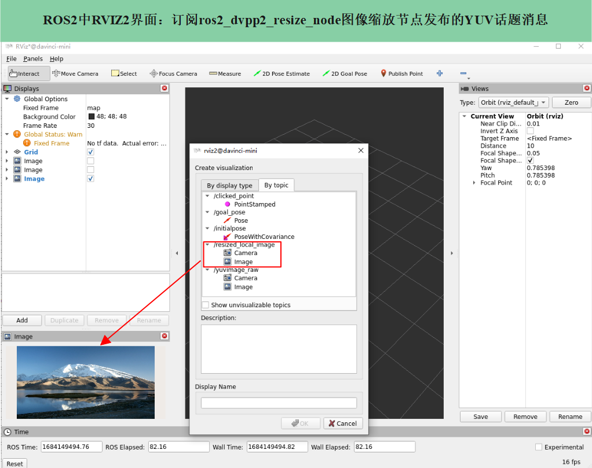

# 媒体数据处理样例（图像缩放）

### 本样例为大家学习机器人ROS2生态及昇腾软件栈提供参考！


## __1. 样例介绍__

以图像缩放作为媒体数据处理样例，详细介绍了如何基于ROS-AscendCL推理框架在ROS2中完成图像缩放功能包（ros2_dvpp2_resize）的开发、编译和运行。

### 1.1. 样例约束

该样例适用于本地图像和摄像头发布的场景，图像格式必须是yuv420sp话题，该样例只支持单输入场景。

输入图片宽高要求：18 * 6 ~ 8192 * 8192。

输出宽高范围选择：32 * 6 ~ 4096 * 4096，其中要保证宽16对齐，高2对齐。


### 1.2. 样例功能

该样例基于AscendCL中DVPP V2图像缩放接口，并结合ROS2机制，实现了对yuv420sp图像按一定比例缩放或缩放到固定尺寸。

- 样例输入：原始yuv420sp格式图片。
- 样例输出：缩放后的yuv420sp格式图片。

当前样例是将1920x1080的图像缩放到960x540，开发者可自定义缩放尺寸，将图像缩放为期望宽高的yuv420sp图像。

### 1.3. 样例原理

基于ROS-AscendCL实现媒体数据处理任务，其设计思想是基于AscendCL中DVPP V2接口并结合ROS2框架机制，封装DvppProcess类以构建媒体数据处理节点。DvppProcess类的实现过程与AscendCL中DVPP的VPC功能实现过程大致一样，具体请参考[《应用开发指南》《应用软件开发指南 (C&C++)》中“媒体数据处理V2 > VPC图片处理典型功能 > 接口调用流程”](https://www.hiascend.com/document/detail/zh/CANNCommunityEdition/63RC1alpha001/infacldevg/aclcppdevg/aclcppdevg_000069.html)章节。

以图像缩放操作为例，DvppProcess类的具体实现如下图-DvppProcess类实现图所示：




### 1.4. 样例代码

单击[ROS-AscendCL代码仓](https://gitee.com/HUAWEI-ASCEND/ascend-devkit/tree/master/src/E2E-Sample/ROS-AscendCL)，进入“ascend-devkit/src/E2E-Sample/ROS-AscendCL”目录，其中ros2_dvpp2_resize是图像缩放功能包，具体介绍请阅读readme.md。

- __功能包目录结构__
```
|---- data                         // 提供原始输入图片
|    |---- dvpp_vpc_1920x1080_nv12.yuv 
|---- include
|    |---- DvppProcess.h           // DVPP图像处理类声明头文件
|    |---- Utils.h                 // 工具类函数声明头文件
|---- src
|    |---- DvppProcess.cpp         // DVPP图像处理类实现源文件
|    |---- Utils.cpp               // 工具类函数实现源文件
|    |---- Ros2Dvpp2Resize.cpp     // 图像缩放节点源文件
|    |---- PublisherYuvMsg.cpp     // 图像发布节点源文件
|---- launch
|    |---- ros2_dvpp2_launch.py    // 节点启动文件
|---- CMakeLists.txt               // ROS功能包编译脚本
|---- package.xml                  // ROS功能包配置文件，添加节点依赖项

```

- __功能包代码__

    DVPP图像缩放功能包代码一共包含4个模块，分别是图像处理类代码、工具类代码、节点源代码、节点启动代码，代码中涉及的关键API介绍可以参考[ROS-AscendCL开发指南中 9.2-图像缩放样例API](https://gitee.com/HUAWEI-ASCEND/ascend-devkit/tree/master/src/E2E-Sample/ROS-AscendCL)，其中一些VPC和DVPP V2的底层接口可以参考后面的 **参考资源**。

    - DVPP图像处理类代码：实现图像缩放过程的核心代码，即DvppProcess.h、DvppProcess.cpp。
    - 工具类代码：实现公共功能的函数，即Utils.h、Utils.cpp。
    - 节点源代码：ROS2节点的入口代码，即Ros2Dvpp2Resize.cpp、PublisherYuvMsg.cpp。
    - 节点启动代码：ros2_dvpp2_launch.py。
launch文件定义了待启动的ROS2节点，还有图像缩放相关的参数（如模型路径、模型名称、输入/输出数据大小等）。开发者需根据自身实际情况，自行删减或修改相关参数，并同步在源代码的参数声明和使用的地方适配。

    __参考资源__ 
    - DVPP V2底层逻辑接口调用流程，可参考[《应用开发指南》《应用软件开发指南 (C&C++)》中“媒体数据处理V2 > VPC图片处理典型功能 > 接口调用流程”章节](https://www.hiascend.com/document/detail/zh/CANNCommunityEdition/63RC1alpha001/infacldevg/aclcppdevg/aclcppdevg_000069.html)。
    - DVPP V2缩放功能的接口调用示例，可参考[《应用开发指南》《应用软件开发指南 (C&C++)》中“媒体数据处理V2 > VPC图片处理典型功能 >缩放”示例](https://www.hiascend.com/document/detail/zh/CANNCommunityEdition/63RC1alpha001/infacldevg/aclcppdevg/aclcppdevg_000071.html)。


### 1.5. 样例开发前准备
- 硬件准备：
    请提前准备好Atlas 200I DK A2开发者套件所需的相关硬件，具体请参考[硬件准备清单](https://www.hiascend.com/document/detail/zh/Atlas200IDKA2DeveloperKit/23.0.RC1/qs/qs_0001.html)。

- 软件准备：
    使用ROS-AscendCL开发前，还需要准备相应的运行和开发环境，具体要求如下表-软件要求所示。


| 配套组件 | 版本要求 | 安装说明 |
|---|---|---|
| 板端操作系统操作系统 | Ubuntu 22.04 | 请使用Atlas 200I DK A2官网提供的[一键制卡工具](https://www.hiascend.com/hardware/developer-kit-a2/resource)，将系统镜像一键烧录至SD卡中，镜像里已包含操作系统、CANN和ROS2软件包。<br> (1) 单击“快速入门>准备>下载制卡工具”，下载软件至本地PC，直接双击运行“Ascend-devkit-imager_1.1.6_win-x86_64.exe” <br> (2) 在弹出的“一键制卡工具”页面，完成镜像烧录 <br> a. 选择制卡方式，推荐“在线制卡” <br> b. 选择镜像版本，建议选择“E2E-Samples-Image_23.0.RC1_ubuntu22.04” <br> c. 在线制卡时，需要保证PC能稳定访问网络。单击“配置网络信息”，根据实际情况填写网络信息。注意，带宽率建议在300Mbps以上 <br> d. 选择待烧录的SD卡（空间最好>=64GB） <br> e. 单击“烧录镜像”，等待一段时间，烧录成功 |
| CANN | >=6.2 | SD卡的系统镜像中已预装CANN，注意固件与驱动版本 |
| ROS2 | Humble | SD卡的系统镜像中已预装ROS2-Humble |
| 第三方依赖 | OpenCV 4.5.4 | 在目标检测样例场景下（ros2_acl_inference），需要安装OpenCV。<br>检查环境里是否已安装OpenCV，执行以下命令查询安装版本：<br>```pkg-config opencv --modversion```<br>若未安装OpenCV，执行如下命令安装：<br>```sudo apt-get install libopencv-dev``` |


&nbsp;

## __2. 调用流程__

### 2.1. 接口调用流程
基于ROS-AscendCL实现图像缩放时，DvppProcess类中核心调用的是DVPP V2的resize接口，详细的调用流程如下图-图像缩放样例中DVPP调用流程所示。




### 2.2. 节点调用流程
图像缩放功能包（ros2_dvpp2_resize）定义了图像发布节点publisher_yuvmsg_node和图像缩放节点ros2_dvpp2_resize_node，前者用于发布ROS2格式图像话题消息，后者用于实现缩放操作。如需验证图像缩放节点的输出，可增加可视化节点display_node。节点间详细的调用流程如下图-图像缩放样例节点图所示。



- 当输入模式为LOCALIMG：从本地读取YUV图像（.yuv），发布缩放后ROS2格式YUV图像话题消息

    (1) ros2_dvpp2_resize_node：从本地读取YUV图片，图片缩放后将结果以ROS msg形式发布到/resized_local_image话题上，供下游任务处理。

    (2) （可选）display _node：通过订阅/resized_local_image话题获取缩放结果，并基于ROS2中RViz2工具进行可视化呈现。

- 当输入模式为SUBMSG：接收ROS2格式YUV图像话题消息（sensor_msgs::msg::Image），发布缩放后ROS2格式YUV图像话题消息

    (1) publisher_yuvmsg_node：将采集的图像数据按一定帧率以ROS msg形式发布到/yuvimage_raw话题上。

    (2) ros2_dvpp2_resize_node：通过订阅/yuvimage_raw话题获取输入图片，图片缩放后将结果以ROS msg形式发布到/resized_submsg_image话题上，供下游任务处理。

    (3) （可选）display _node：通过订阅/resized_submsg_image话题获取缩放结果，并基于ROS2中RViz2工具进行可视化呈现。

&nbsp;

## __3. 编译和运行__

首先需要确认ros2-humble的环境变量是否配置好（humble版本的ROS2安装目录，一般默认在/opt/ros/humble下，如果不是，请修改至自己设置的目录下），执行下面的两行指令；第一行指令是使当前终端窗口的ro2配置生效，第二行指令是为了新打开终端窗口，ros2环境变量配置自动生效。
```
$ source /opt/ros/humble/setup.bash
$ echo " source /opt/ros/humble/setup.bash" >> ~/.bashrc 
```

执行完上面两个指令后，在终端窗口内键入ros2这四个字符，然后点击回车，如果出现类似如下打印信息，就说明ros2配置成功：
```
usage: ros2 [-h] [--use-python-default-buffering] Call `ros2 <command> -h` for more detailed usage. ...

ros2 is an extensible command-line tool for ROS 2.

Commands:
  action     Various action related sub-commands
  bag        Various rosbag related sub-commands
......
```

按照如下步骤完成图像缩放功能包的编译和运行。

### 3.1. 创建工作空间。
打开一个终端窗口，执行如下命令创建工作空间（以“ros2_workspace_dvpp”为例，可自定义），其中\$HOME代表工作空间根目录。
```
mkdir -p $HOME/ros2_workspace_dvpp/src
cd $HOME/ros2_workspace_dvpp
```

### 3.2. 下载功能包代码。
从[ROS-AscendCL代码仓](https://gitee.com/HUAWEI-ASCEND/ascend-devkit/tree/master/src/E2E-Sample/ROS-AscendCL)下载图像缩放样例代码至\\$HOME/ros2_workspace_dvpp/src目录下，然后进入“ascend-devkit/src/E2E-Sample/ROS-AscendCL”目录，找到ros2_dvpp2_resize文件夹，并将该文件夹移动到\\$HOME/ros2_workspace_dvpp/src目录下（\\$HOME/ros2_workspace_dvpp/src及其子文件中不能同时存在多个文件夹同名的功能包文件，否则会报错，因此需要进行移动操作，而不是复制操作）。如果使用git方式下载代码，可参考如下命令：
```
git clone https://gitee.com/HUAWEI-ASCEND/ascend-devkit.git
```

### 3.3. 配置节点启动文件。
(1) 打开节点启动文件ros2_dvpp2_launch.py。
```
vim $HOME/ros2_workspace_dvpp/src/ros2_dvpp2_resize/launch/ros2_dvpp2_launch.py
```

(2) 根据实际情况，修改图像发布节点和图像缩放节点的相关参数，如图像话题名称和图像宽高参数等（输入输出图像的宽高及对齐要求，注意查看 __1.1. 样例约束__ 中的内容），请参考[编译和运行 3.2.](https://gitee.com/HUAWEI-ASCEND/ascend-devkit/blob/master/src/E2E-Sample/ROS-AscendCL/ROS-AscendCL%E5%BC%80%E5%8F%91%E6%8C%87%E5%8D%97/context/%E7%BC%96%E8%AF%91%E5%92%8C%E8%BF%90%E8%A1%8C-2.md)。

### 3.4. 编译功能包，并配置环境变量。
在\$HOME/ros2_workspace_dvpp文件夹下，执行如下命令，其中\\$HUMBLE代表ROS2 Humble版本安装目录，一般默认在/opt/ros/humble下，配置环境变量指令是为了设置终端窗口的当前ROS版本为ROS2 Humble，避免安装了多版本ROS导致环境变量设置错误。
```
colcon build --packages-select ros2_dvpp2_resize
```

### 3.5. 运行功能包节点。
- 方法1（推荐）：通过launch文件启动所有节点。打开新终端，需要首先进入\$HOME/ros2_workspace_dvpp目录下，执行以下两行指令（不需要其它配置操作）；第一行指令是配置工作空间的环境变量，第二行指令是运行launch文件，启动图像发布节点(publisher_yuvmsg_node)和图像缩放节点(ros2_dvpp2_resize_node)。（备注：如果对launch文件进行了修改，需要重新执行3.4中的编译指令，然后再执行下面的指令。）

    ```
    source install/setup.bash
    ros2 launch ros2_dvpp2_resize ros2_dvpp2_launch.py
    ```

- 方法2：通过ros2 run方式启动指定节点。

    当启动多个节点时，需要新启多个终端窗口分别执行命令。
（备注：如果执行下面的指令出现[ERROR] fopen /root/ros2_workspace_dvpp/src/ros2_dvpp2_resize/data/dvpp_vpc_1920x1080_nv12.yuv failed!”错误，需要修改用户实际的工作空间中“\$HOME/ros2_workspace_dvpp/src/ros2_dvpp2_resize/src/”路径下Ros2Dvpp2Resize.cpp文件65-70L配置内容和PublisherYuvMsg.cpp文件58-61L配置内容。修改结束之后需要重新执行3.4中的编译指令，然后再执行下面的指令。）

    打开新的终端窗口，进入$HOME/ros2_workspace_dvpp文件夹下，执行如下命令，启动图像发布节点。
    ```
    source install/setup.bash
    ros2 run ros2_dvpp2_resize publisher_yuvmsg_node
    ```

    打开新的终端窗口，进入$HOME/ros2_workspace_dvpp文件夹下，执行如下命令，启动图像缩放节点。
    ```
    source install/setup.bash
    ros2 run ros2_dvpp2_resize ros2_dvpp2_resize_node
    ```

### 3.6. 查看运行结果。
- 方法1：节点启动后，可直接在终端窗口查看ROS2消息收发、图像处理相关的打印信息。以launch文件运行为例：
    - 当launch文件中输入模式设为"LOCALIMG"，终端运行结果如下图所示：

    

    - 当launch文件中输入模式设为"SUBMSG"，终端运行结果如下图所示：

    

&nbsp;

- 方法2：通过ROS2自带的RViz2可视化工具查看图像缩放结果。
    - 新启动一个终端窗口，在界面输入命令“rviz2”，自动弹出工具界面。

    ```
   rviz2
    ```
单击工具界面左下方“Add”，在“By topic”菜单下选择/resized_local_image或者/resized_submsg_image话题，然后单击“OK”，可以在工具界面左下方查看缩放后的结果图。此处以输入模式为"SUBMSG"为例：



&nbsp;

## __4. 常见问题__
### 4.1. 执行ros2指令时提示找不到该指令。
- 问题描述

    在终端窗口输入ros2 xxx指令时（比如创建功能包、运行功能包节点等场景），出现如下提示：
    -bash: ros2: command not found
- 可能的原因

    终端窗口中没有设置ros2工作空间的环境变量，尤其是新启一个终端窗口的场景。
- 处理方案

    运行用户在终端窗口执行如下命令，使ros2环境变量生效，其中\$HUMBLE 代表humble版本的ROS2安装目录，一般默认在/opt/ros/humble下。
    
    ````
    source $HUMBLE/setup.bash
    ````

### 4.2. 节点话题的订阅或发布出现失败的情况。
- 问题描述

    功能包中的节点收发话题（topic）消息失败，出现订阅节点一直处于等待消息的状态。

- 可能的原因

    在修改样例代码过程中，引入了一些错误，导致功能包中的部分节点未成功启动。
    例如节点的话题名称被改动了，其他节点对应的接收话题名称没有同步修改。

- 处理方案

    (1) 检查发布和订阅端是否都成功启动。执行如下命令，查看MD5值是否一致。
    ```
    ros2 topic info topic_name
    ```

    (2) 检查同一个话题是否存在多个发布端。如果存在多个发布端，后启动的发布节点是不会生效的，请避免该情况发生。

    (3) 检查订阅端queue size取值是否合理。一般queue size取值建议2及以上，如果queue size=1，可能会导致无实际缓存可用。