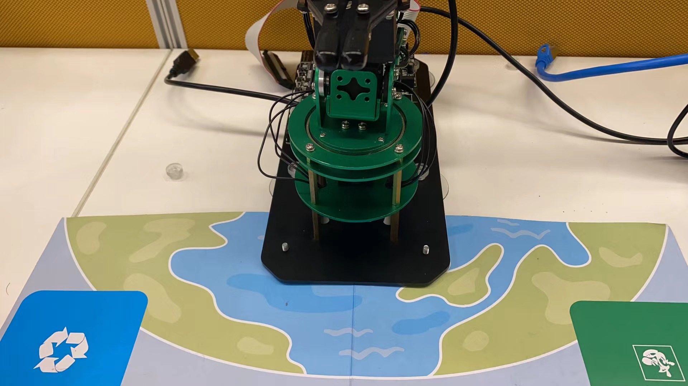
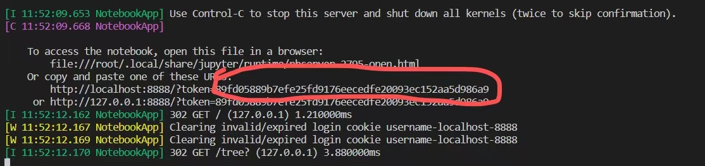
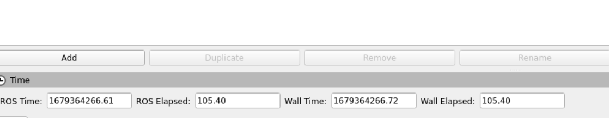
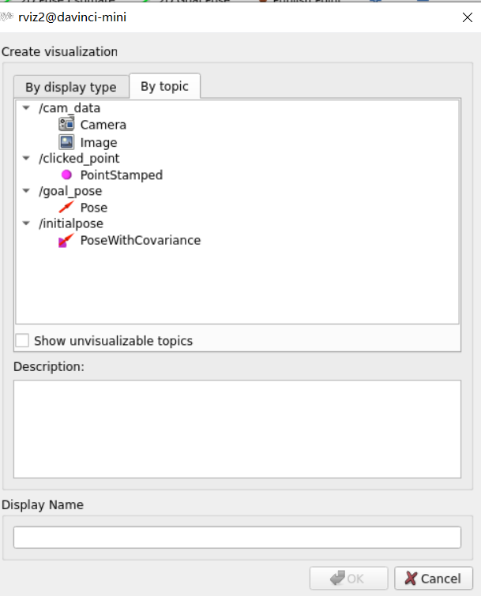
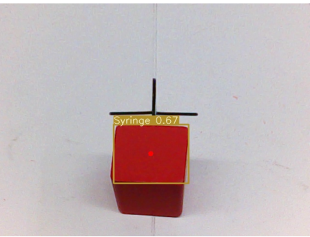

<!-- TOC -->

- [开发测试](#开发测试)
- [步骤](#步骤)
  - [1. 硬件连接](#1-硬件连接)
  - [2. 启动步骤0 - 校准摄像头（**该步骤仅供初次使用！后续可跳过此步骤**）](#2-启动步骤0---校准摄像头该步骤仅供初次使用后续可跳过此步骤)
  - [3. 启动步骤1 - 启动ROS服务器](#3-启动步骤1---启动ros服务器)
  - [4. 启动步骤2 - 启动分拣主程序](#4-启动步骤2---启动分拣主程序)
  - [5. 启动步骤3 - 启动可视化程序：](#5-启动步骤3---启动可视化程序)
  - [6. 启动步骤4 - 针对首次抓取结果，修正硬件噪声（**该步骤仅供初次使用！后续可跳过此步骤**）：](#6-启动步骤4---针对首次抓取结果修正硬件噪声该步骤仅供初次使用后续可跳过此步骤)
  - [7. 启动步骤5 - 切换堆叠功能](#7-启动步骤5---切换堆叠功能)

## 开发测试

本项目分为《色块分拣》和《积木堆叠》两个项目，使用ROS2框架测试系统完成开发测试。目前两个项目DT测试覆盖为均为71%。  

以下为《色块分拣》测试覆盖表格：


以下为《积木堆叠》测试覆盖表格：


## 步骤


### 1. 硬件连接

以200DK为中心，用网线与计算机相连，用白色排线与机械臂相连，用USB线与装在机械臂的摄像头相连，并连接电源通电

硬件示意图：


实物演示图：


**----------注意0：----------**

注意地图有两个小孔，将两小孔分别插入两个吸盘上。


并将机械臂基座最前方（机械爪下方）的两个小孔插入到螺丝内部，如下图所示：



后扭上螺帽即可。
**------注意部分结束----------**

### 2. 启动步骤0 - 校准摄像头（**该步骤仅供初次使用！后续可跳过此步骤**）

目的：可视化界面调整摄像头位置，确保整个十字框可见

为确保方框无法被摄像头拍摄全的问题，现补充图形化界面。

打开一个终端，运行jupyter notebook：`jupyter notebook --allow-root`（如在**MobaXTerm**中启动，则需要添加DK的ip，实例命令：`jupyter notebook --allow-root --ip 192.168.137.100`）

**----------注意1：----------**

第一次启动时可能会有输入密码的情况


这个时候，密码在终端中：



将红框部分复制粘贴即可。

**------注意部分结束----------**

在Jupyter notebook中逐级点击进入目录：`src -> dofbot_garbage_yolov5 -> dofbot_garbage_yolov5`，最终进入`垃圾分拣玩法.ipynb`


随后在如下图所示的`Kernel`选择栏中，点击`Restart & Run All`


**----------注意2：----------**

首次启动后，拉到最下方可能不会有任何显示。如下图所示：


此时拉会到最上方并点击`Restart & Run All`即可。多跑几次，直到出现图形界面为止。

**------注意部分结束----------**


出现的图形界面如下：


图形界面使用步骤如下：

1. 点击`calibration_model`，点击后，拉动上方的滚动条（`joint1`和`joint2`），随着滚动条的拉动，蓝色边框会出现，**请务必确保蓝色边框覆盖整个十字框，具体效果如下（请确保测试环境具备充足的灯光！）：**


2. 当效果如上图所示时，点击`calibration_ok`按钮，则可视化界面进入方框内部。具体效果如下图所示：


**----------注意3：----------**

在调整完显示框后，应关闭jupyter notebook的程序，避免与python主程序发生摄像头冲突。建议使用`Restart`命令进行关闭，如下图所示：


**------注意部分结束----------**

回到终端，使用`Ctrl C`命令终止`jupyter notebook`程序

### 3. 启动步骤1 - 启动ROS服务器

目的： 启动ROS服务器

使用**MobaXTerm**打开**第一个终端**，在当前窗口运行：`ros2 run dofbot_moveit dofbot_server`

### 4. 启动步骤2 - 启动分拣主程序

目的：启动Python主程序

使用**MobaXTerm**打开**第二个终端**，输入如下命令进入目录：

```
cd src/dofbot_garbage_yolov5/dofbot_garbage_yolov5
```

输入如下命令启动主程序：

```
python main.py
```

### 5. 启动步骤3 - 启动可视化程序：

使用**MobaXTerm**打开**第三个终端**，输入`rviz2`，点击左下角的`add`按钮



在上方选择`By Topic`，双击`/cam_data`下的`Image`按钮添加Image可视化栏。



添加后，将色块放入摄像头可见位置（确实色块完全可见，而不是部分可见），效果如下图所示



等模型预热数秒钟后，即会完成抓取动作。

### 6. 启动步骤4 - 针对首次抓取结果，修正硬件噪声（**该步骤仅供初次使用！后续可跳过此步骤**）：

经过对比不同机械臂发现，即使是相同商家生产的机械臂，每一款产品在出厂时也存在硬件上的规格差异，俗称噪音，**如果首次存在无法抓取的情况，玩家需要根据自己手中的机械臂手动配置噪声参数**

通过如下命令进入配置文件的目录：

```
cd src/dofbot_garbage_yolov5/dofbot_garbage_yolov5/config
```

使用通过`MobaXTerm`或`vim`工具修改`offset.txt`文件，在该txt文件中修改噪音参数：

1. 如发现机械臂抓取略微靠后（色块后方），导致无法抓取，则需要适当加大该参数（如从0.008修正到0.01）
2. 如发现机械臂抓取略靠前（色块前方），导致无法抓取，则需要适当减少该参数（如从0.008修正到0.006）

反复修改该参数，重复该流程，直到合适抓取位置。

随后，将该配置目录下的配置文件`XYT_config.txt`、`dp.bin`、`offset.txt`复制粘贴到如下目录：`/home/HwHiAiUser/RobotArmProject/ros2_dofbot_formal_ws/src/dofbot_color_stacking/scripts/config`中。使得下一步骤的堆叠功能，共享当前的配置


### 7. 启动步骤5 - 切换堆叠功能

首先使用`Ctrl C`结束第二个终端中的python主程序。

随后使用如下命令进入目录：

```
cd /home/HwHiAiUser/RobotArmProject/ros2_dofbot_formal_ws/src/dofbot_color_stacking/scripts
```

启动堆叠主程序：

```
python main.py
```

稍作预热，即可在第三个终端的可视化界面中观测到机械臂上摄像头的实时画面。
