[toc]

## 开发测试

本项目分为《色块分拣》和《积木堆叠》两个项目，使用ROS2框架测试系统完成开发测试。目前两个项目DT测试覆盖为均为71%。  

以下为《色块分拣》测试覆盖表格：

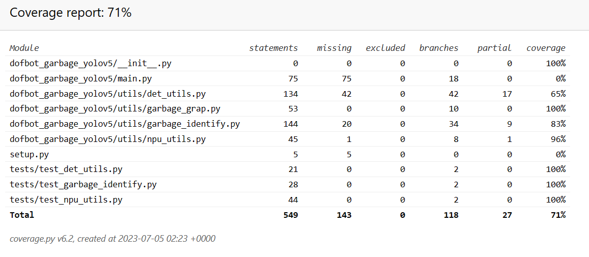

以下为《积木堆叠》测试覆盖表格：

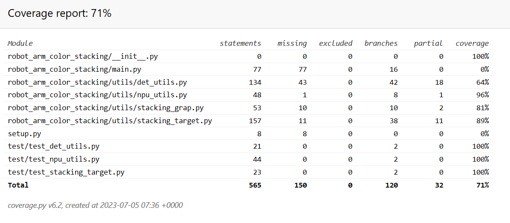

## DK环境准备

### 下载代码

登录Atlas 200I DK A2，使用`git clone https://gitee.com/HUAWEI-ASCEND/ascend-devkit.git`将代码仓下载至本地。进入下载好的文件夹，将`ascend-devkit/src/E2ESamples/ros2_robot_arm`文件夹复制到`/root`目录下。

### 预备步骤

确保DK联网。

在`~/.bashrc`文件末尾新增一行：`conda deactivate`（**注：不用机械臂时，请自行将这一行注释掉**），随后保存并退出`~/.bashrc`文件，在命令行中输入`source ~/.bashrc`  

将`ros2_robot_arm`文件夹放入`/root`目录中。并使用链接（[https://ascend-repo.obs.cn-east-2.myhuaweicloud.com/Atlas%20200I%20DK%20A2/DevKit/samples/23.0.RC1/e2e-samples/Arm/robot_arm_dependency.zip]）下载依赖压缩文件，将该压缩文件放入`ros2_robot_arm`文件夹中。使用`unzip robot_arm_dependency.zip`命令对依赖文件压缩包进行解压。

### 安装ROS

请按照顺序依次执行如下命令：  
1. `sudo apt install -y software-properties-common`  
2. `sudo curl -sSL https://raw.githubusercontent.com/ros/rosdistro/master/ros.key -o /usr/share/keyrings/ros-archive-keyring.gpg`（**本条命令将尝试访问github，如遇卡顿，请多尝试几次**）  
3. `echo "deb [arch=$(dpkg --print-architecture) signed-by=/usr/share/keyrings/ros-archive-keyring.gpg] http://packages.ros.org/ros2/ubuntu $(. /etc/os-release && echo $UBUNTU_CODENAME) main" | sudo tee /etc/apt/sources.list.d/ros2.list > /dev/null`  
4. `sudo apt update`  
5. `sudo apt install -y libegl-mesa0`  
6. `sudo apt install -y ros-humble-desktop`  
7. `sudo apt install -y python3-colcon-common-extensions`  
8. `sudo apt install -y pip`  

### 安装ais_bench（如遇卡顿，请自行换源安装）

请按照顺序依次执行如下命令：  
1. `pip3 install -v 'git+https://gitee.com/ascend/tools.git#egg=aclruntime&subdirectory=ais-bench_workload/tool/ais_bench/backend'`  
2. `pip3 install -v 'git+https://gitee.com/ascend/tools.git#egg=ais_bench&subdirectory=ais-bench_workload/tool/ais_bench'`  

### 安装其他依赖

进入目录`ros2_robot_arm`，执行如下命令  
1. `pip3 install -r requirements.txt`  
2. `sudo dpkg -i libconsole-bridge0.4_0.4.4+dfsg-1build1_arm64.deb`  
3. `sudo dpkg -i liburdfdom-world_1.0.0-2ubuntu0.1_arm64.deb`  

将如下环境变量添加至`~/.bashrc`文件中  
`LD_LIBRARY_PATH=$LD_LIBRARY_PATH:/usr/lib:/usr/lib/aarch64-linux-gpu:/usr/local/lib`  
随后执行：`source ~/.bashrc`  

将`libdofbot_kinemarics.so`放入`/usr/lib`中：`cp libdofbot_kinemarics.so /usr/lib`

### 安装orocos_kdl

进入目录`ros2_robot_arm`，依次执行如下命令  
1. `cd orocos_kdl && mkdir build && cd build`  
2. `cmake ..`  
3. `make -j4`  
4. `sudo make install`  

### 安装机械臂底层驱动

进入目录`ros2_robot_arm`，执行如下命令  
1. `cd 0.py_install`  
2. `python3 setup.py install`  

### 模型下载

查看链接: `https://ascend-repo.obs.cn-east-2.myhuaweicloud.com/Atlas%20200I%20DK%20A2/DevKit/downloads/23.0.RC1/Ascend-devkit_23.0.RC1_downloads.xlsx`  

将yolov5模型放置在如下两个目录下：  

1. `/root/ros2_robot_arm/ros2_ws/src/dofbot_garbage_yolov5/dofbot_garbage_yolov5/model`  
2. `/root/ros2_robot_arm/ros2_ws/src/robot_arm_color_stacking/robot_arm_color_stacking/model`  

### 编译工作空间

进入目录`ros2_robot_arm`，  
`. setenv.sh`，执行完出现提示信息：`-bash: ./ros2_ws/install/setup.bash: No such file or directory`，忽略即可。
`cd ros2_ws && colcon build`

## 硬件连接

以200DK为中心，用网线与计算机相连，用白色排线与机械臂相连，用USB线与装在机械臂的摄像头相连，并连接电源通电

硬件示意图：

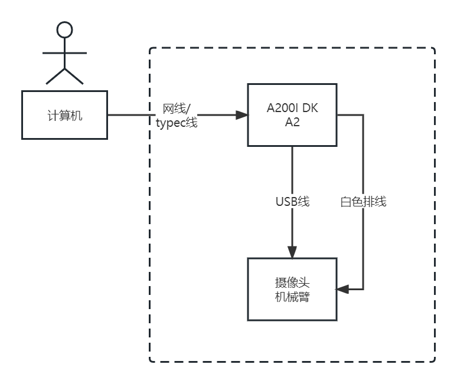

实物演示图：

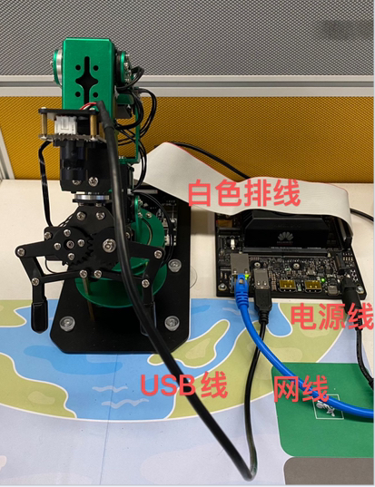

**----------注意0：----------**

注意地图有两个小孔，将两小孔分别插入两个吸盘上。

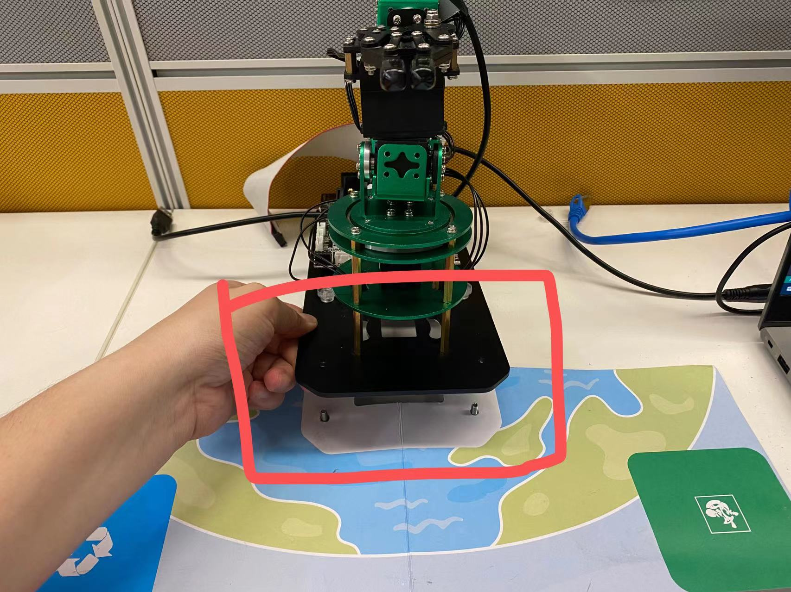

并将机械臂基座最前方（机械爪下方）的两个小孔插入到螺丝内部，如下图所示：

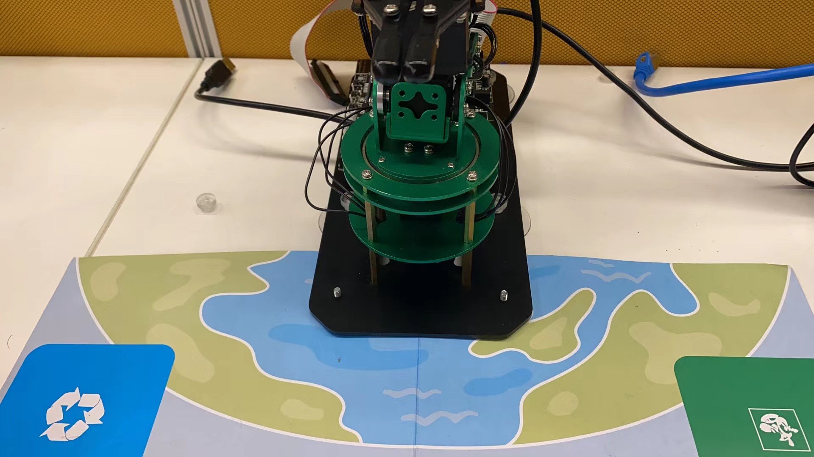

后扭上螺帽即可。
**------注意部分结束----------**


## 校准摄像头（**该步骤仅供初次使用！后续可跳过此步骤**）

目的：可视化界面调整摄像头位置，确保整个十字框可见

为确保方框无法被摄像头拍摄全的问题，现补充图形化界面。

打开一个终端，运行jupyter notebook：`jupyter notebook --allow-root`（如在**MobaXTerm**中启动，则需要添加DK的ip，实例命令：`jupyter notebook --allow-root --ip 192.168.137.100`）

**----------注意1：----------**

第一次启动时可能会有输入密码的情况

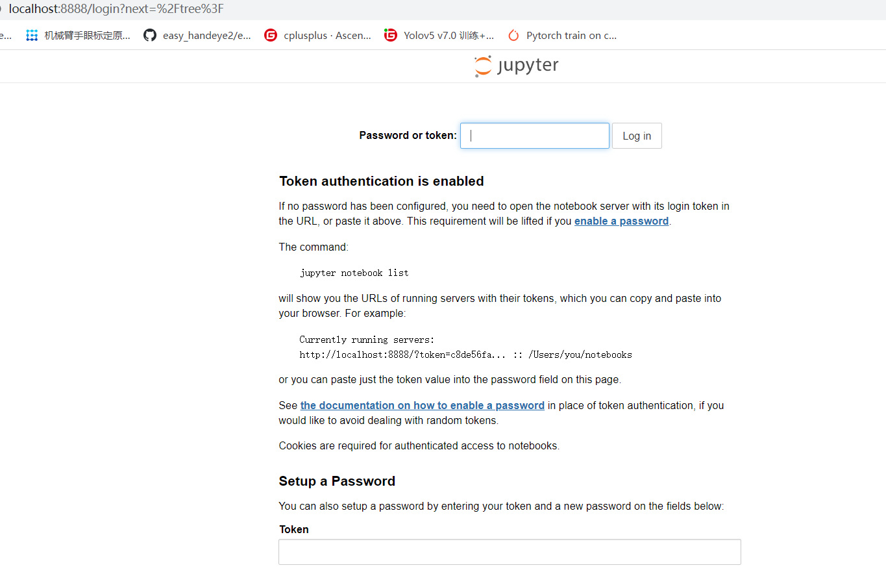

这个时候，密码在终端中：

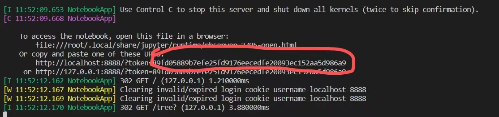

将红框部分复制粘贴即可。

**------注意部分结束----------**

在Jupyter notebook中逐级点击进入目录：`/root/ros2_robot_arm/ros2_ws/src/dofbot_garbage_yolov5/tools`，最终进入`相机校准.ipynb`

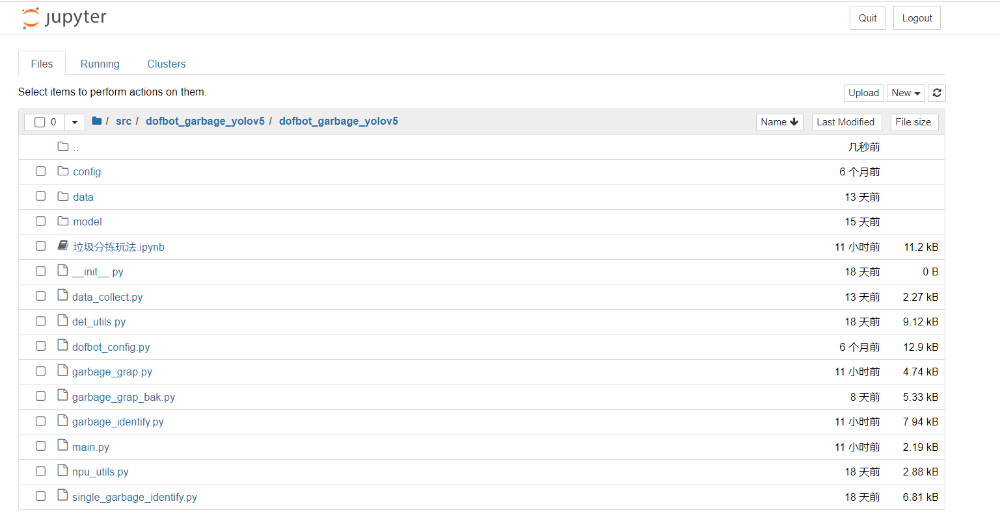


随后在如下图所示的`Kernel`选择栏中，点击`Restart & Run All`

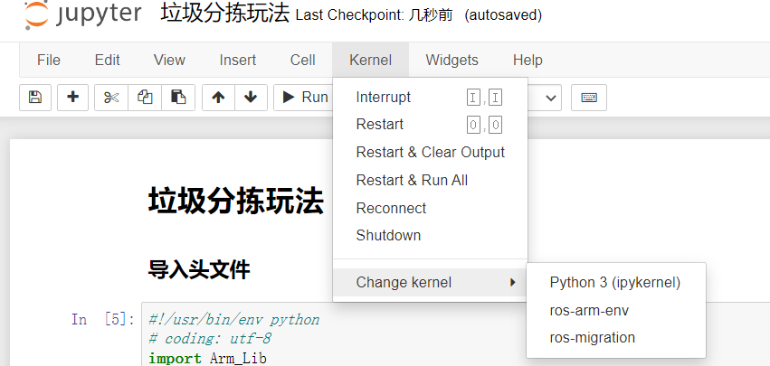


**----------注意2：----------**

首次启动后，拉到最下方可能不会有任何显示。如下图所示：

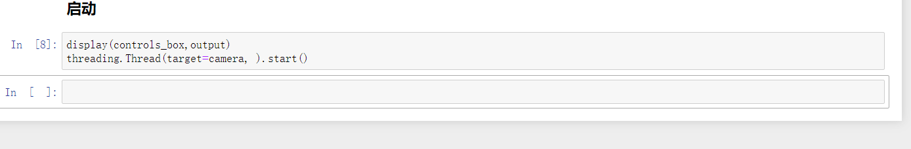

此时拉会到最上方并点击`Restart & Run All`即可。多跑几次，直到出现图形界面为止。

**------注意部分结束----------**


出现的图形界面如下：

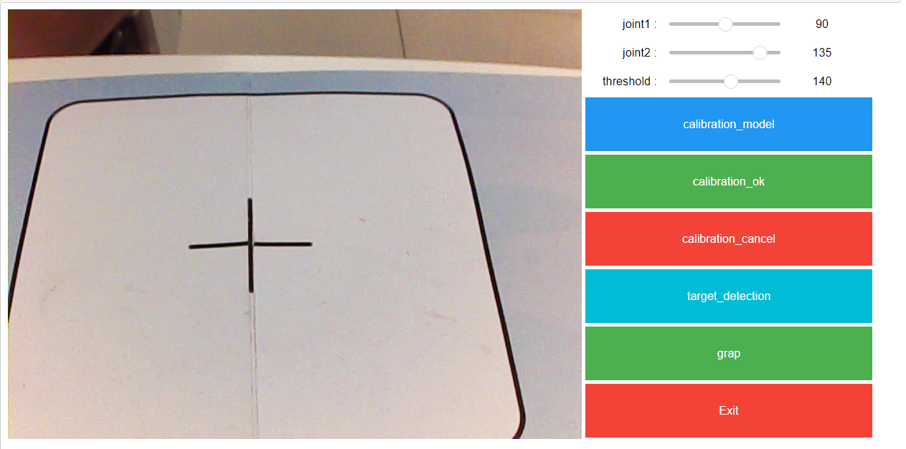

图形界面使用步骤如下：

1. 点击`calibration_model`，点击后，拉动上方的滚动条（`joint1`和`joint2`），随着滚动条的拉动，蓝色边框会出现，**请务必确保蓝色边框覆盖整个十字框，具体效果如下（请确保测试环境具备充足的灯光！）：**

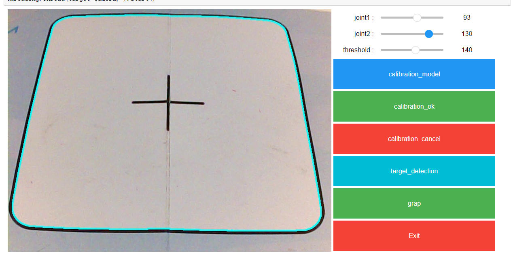

2. 当效果如上图所示时，点击`calibration_ok`按钮，则可视化界面进入方框内部。具体效果如下图所示：

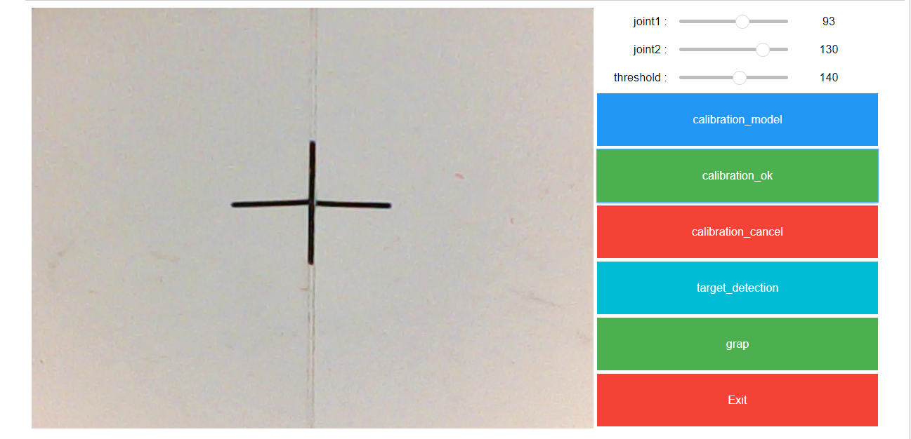

**----------注意3：----------**

在调整完显示框后，应关闭jupyter notebook的程序，避免与python主程序发生摄像头冲突。建议使用`Restart`命令进行关闭，如下图所示：

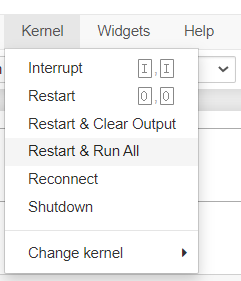

**------注意部分结束----------**

回到终端，使用`Ctrl C`命令终止`jupyter notebook`程序

## 启动机械臂单个积木抓取

开启两个窗口，每个窗口下都执行如下操作，
进入目录`ros2_robot_arm`，
在每个窗口下都执行`. setenv.sh`
在第一个窗口中执行：`ros2 run dofbot_moveit dofbot_server`
在第二个窗口中执行：`ros2 run dofbot_garbage_yolov5 block_cls`


## 对于抓取不准的问题，需针对首次抓取结果，人工修正硬件噪声（**该步骤仅供初次使用！后续可跳过此步骤**）：

经过对比不同机械臂发现，即使是相同商家生产的机械臂，每一款产品在出厂时也存在硬件上的规格差异，俗称噪音，**如果首次存在无法抓取的情况，玩家需要根据自己手中的机械臂手动配置噪声参数**

通过如下命令进入配置文件的目录：

```
cd /root/ros2_robot_arm/ros2_ws/src/dofbot_garbage_yolov5/dofbot_garbage_yolov5/config
```

使用通过`MobaXTerm`或`vim`工具修改`offset.txt`文件，在该txt文件中修改噪音参数：

1. 如发现机械臂抓取略微靠后（色块后方），导致无法抓取，则需要适当加大该参数（如从0.008修正到0.01）
2. 如发现机械臂抓取略靠前（色块前方），导致无法抓取，则需要适当减少该参数（如从0.008修正到0.006）

反复修改该参数，重复该流程，直到合适抓取位置。

随后，将该配置目录下的配置文件`XYT_config.txt`、`dp.bin`、`offset.txt`复制粘贴到如下目录：`/root/ros2_robot_arm/ros2_ws/src/robot_arm_color_stacking/robot_arm_color_stacking/config`中。使得下一步骤的堆叠功能，共享当前的配置


## 启动机械臂积木堆叠程序

开启两个窗口，每个窗口下都执行如下操作，
进入目录`ros2_robot_arm`，
在每个窗口下都执行`. setenv.sh`
在第一个窗口中执行：`ros2 run dofbot_moveit dofbot_server`
在第二个窗口中执行：`ros2 run robot_arm_color_stacking color_stacking`