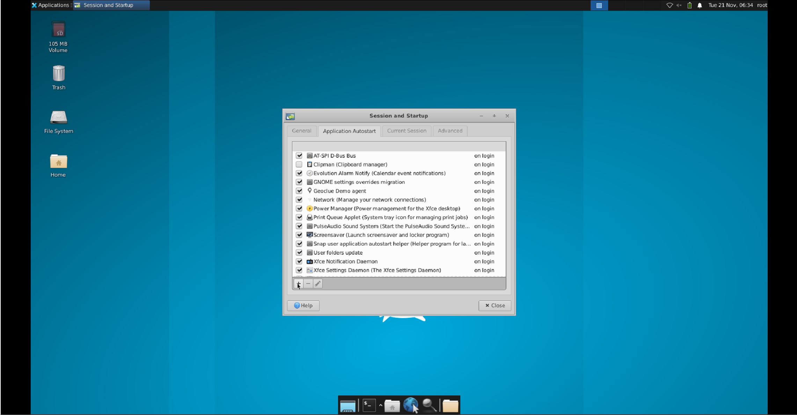
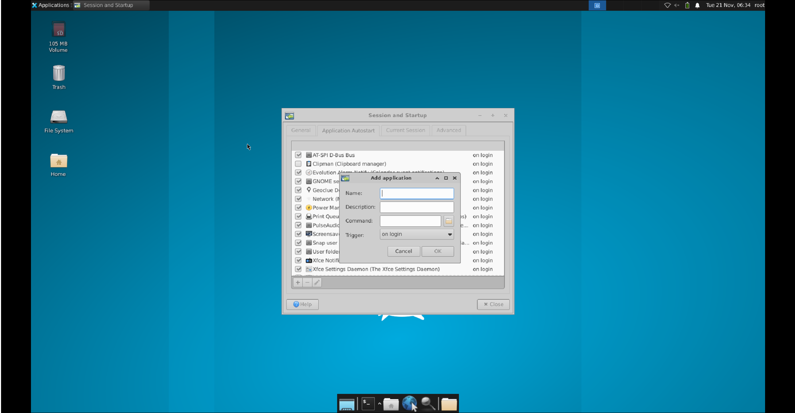
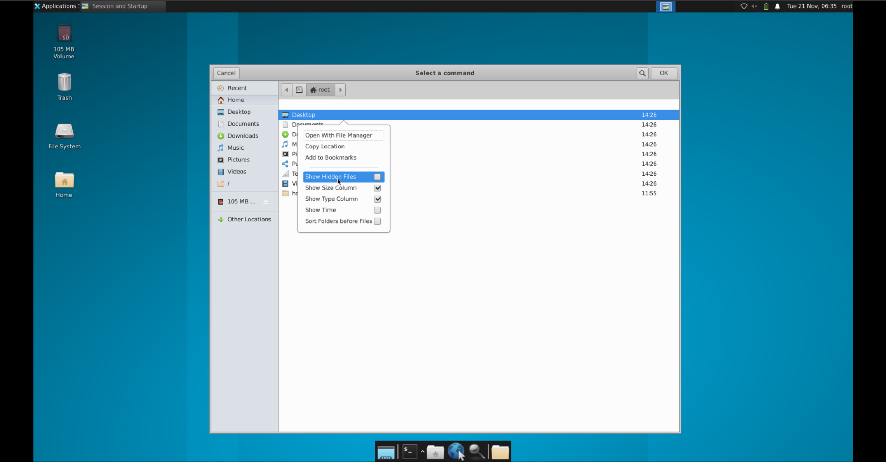
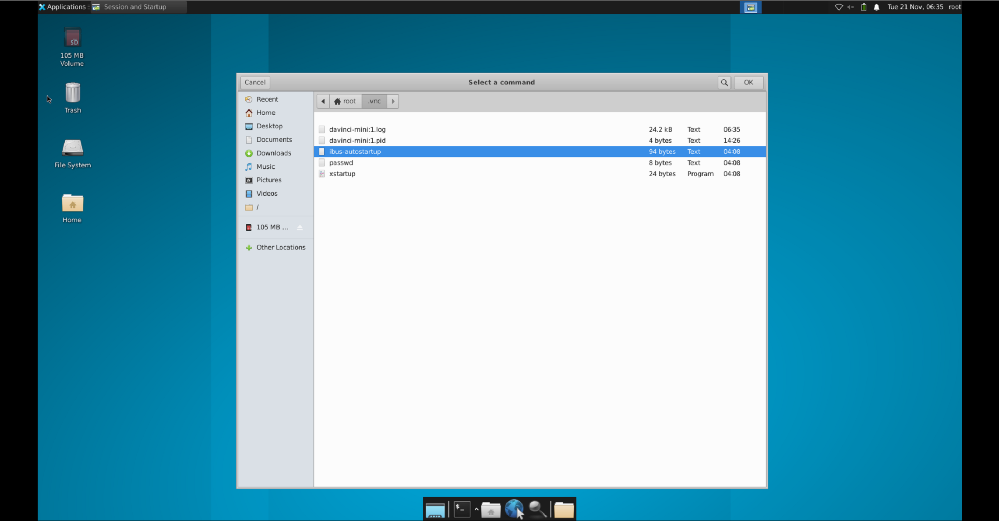
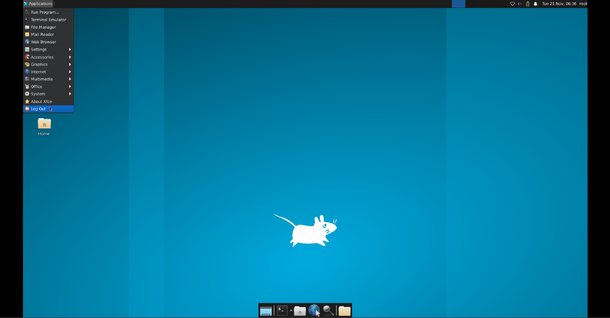
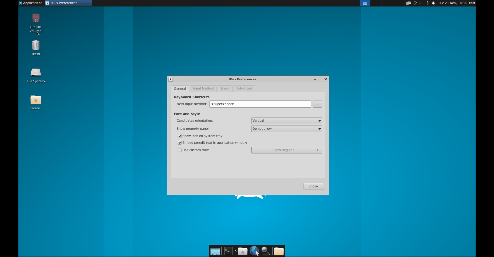
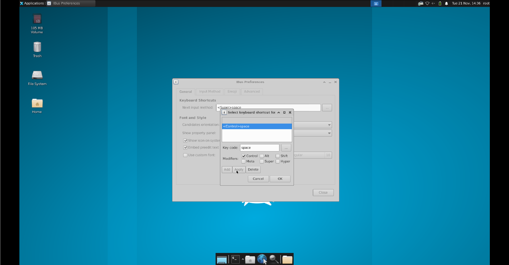
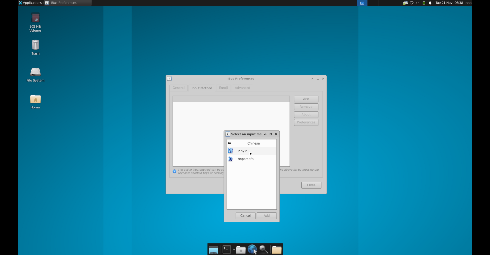
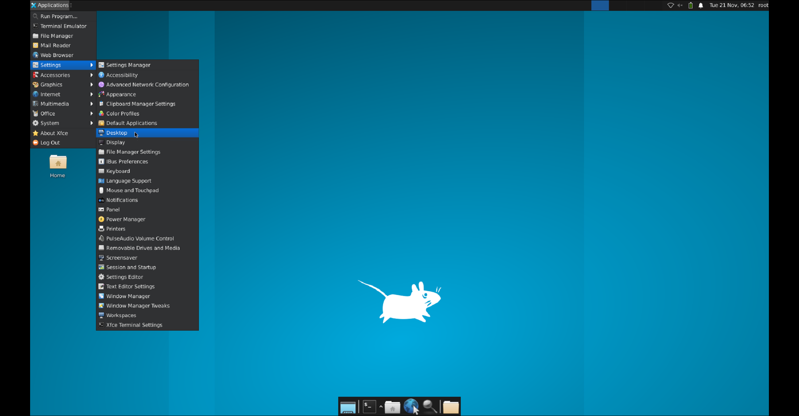
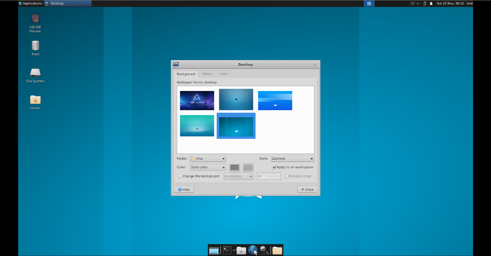

<div align=center>
  
</div>
<div align=center><h1>从零开始的镜像制作</h1></div>
<div style="font-size:1.1em;margin-bottom:2em;" align="center">基于Ubuntu和OpenEuler制作Atlas200I DK A2镜像</div>
<div style="font-size:1.1em;font-weight:bold" align=center>
  <p>
  <a style="margin-right:1em;" href="https://www.hiascend.com/zh/">昇腾官网</a>
  <a style="margin-right:1em;" href="https://www.hiascend.com/hardware/developer-kit-a2/resource">开发资源</a>
  <a style="margin-right:1em;" href="https://www.hiascend.com/forum/">昇腾论坛</a>
  <a href="https://gitee.com/HUAWEI-ASCEND/ascend-devkit/wikis/A200I%20DK%20A2/Atlas%20200I%20DK%20A2%20%E9%95%9C%E5%83%8F%E8%AE%BE%E8%AE%A1%E6%96%87%E6%A1%A3">镜像文档</a>
  </p>
</div>
<div style="font-size:2.0em" align=center>
  <p>
  <a href="https://gitee.com/HUAWEI-ASCEND/ascend-devkit/pulls"></a>
  <a href="https://gitee.com/HUAWEI-ASCEND/ascend-devkit/issues"></a>
  <a href="https://gitee.com/HUAWEI-ASCEND/ascend-devkit/stargazers"></a>
  <a href="https://gitee.com/HUAWEI-ASCEND/ascend-devkit/members"></a>
  </p>
</div>

## 1 介绍

~~你好呀，欢迎来到从零开始的镜像制作生活。~~

本文介绍了以**Ubuntu**或者**OpenEuler**文件系统为始，制作**Atlas 200I DK A2开发板镜像**流程。

需要用户拥有**一定的Linux基础**，并且想要自己制作一个镜像的**决心** (相信我这很重要)。

按照本流程操作后，除了原始系统本身功能和依赖外，镜像中还会存在：

1. Ascend 310B 固件
2. Ascend 310B npu驱动
3. CANN
4. mxVision
5. miniconda (OpenEuler不含) 以及python
6. jupyterlab、protobuf等相关pip依赖
7. aclruntime和ais_bench

## 2 特性

1. 多系统多版本：支持基于Ubuntu和OpenEuler系统制作镜像，用户也可自行添加其他系统脚本；
2. 配置动态修改：用户可以通过修改配置文件来控制制作过程中脚本的行为；
3. 中断异常策略：在中断或者异常退出后再次执行脚本，会以中断或异常退出的函数为开始 (目前无法精确到行) 执行脚本；
4. 可重复执行性：在全部运行完毕后，配置文件将会刷新函数控制相配置项，使用户在无需还原配置文件的条件下可以直接反复运行脚本；
5. 脚本结构清晰：参见结构章节，用户可以自行选择以哪种镜像为最终目的；

## 3 准备

制作Atlas 200I DK A2镜像所需软硬件条件如下：

1. 一台带有USB接口、系统为Linux aarch64、**使用apt命令进行下载** (当前脚本只支持apt命令) 的服务器 (这里服务器是泛指概念，开发板自身都可以，只要满足使用条件)
2. 另一台可以使用Micro SD卡作为运行系统的服务器 (如果上述服务器可以也可以用同一个)
3. 一个读卡器
4. 一张容量至少为32G (保留至少有15G的空间，因为压缩扩容镜像的制作需要12G左右的空间) 的SD卡
5. 请保持网络畅通，**尤其是与GitHub的网络**

## 4 结构

本章节简要介绍脚本整体结构，详细信息请查看文档。

镜像制作分为**最小镜像(minimal)**、**完整镜像(complete)**、**压缩扩容镜像(compress)** 三个模块，介绍如下：

| 模块名称   | 对应路径         | 功能简介               |
|--------|--------------|--------------------|
| 最小镜像   | src/minimal  | 可以在DK上启动但缺少部分依赖的镜像 |
| 完整镜像   | src/complete | 完整依赖镜像             |
| 压缩扩容镜像 | src/compress | 带有压缩扩容功能的完整依赖镜像    |

具体目录结构如下：

```
image-builder
├── README.md
├── complete
│   ├── base.sh
│   ├── openEuler
│   │   └── 22.03
│   │       ├── cfg.json
│   │       └── func.sh
│   └── ubuntu
│       └── 22.04
│           ├── cfg.json
│           └── func.sh
├── compress
│   ├── E2E_samples_download_tool.sh
│   ├── base.sh
│   ├── config.ini
│   ├── openEuler
│   │   └── 22.03
│   │       └── expand.sh
│   └── ubuntu
│       └── 22.04
│           └── expand.sh
└── minimal
    ├── base.sh
    ├── openEuler
    │   └── 22.03
    │       ├── cfg.json
    │       └── func.sh
    └── ubuntu
        └── 22.04
            ├── cfg.json
            └── func.sh
```

每个模块组成如下：

| 名称        | 功能                                 |
|-----------|------------------------------------|
| base.sh   | 脚本入口，承载与发行版本无关的公共功能                |
| 发行版名称/版本号 | 目前提供ubuntu和openEuler版本             |
| cfg.json  | 配置文件，例如依赖下载链接，运行函数执行逻辑等            |
| func.sh   | 函数库，制作镜像核心命令，包括依赖安装，增加服务，修改系统配置文件等 |

**注意：**

1. **用户可以自行添加或修改发行版名称和版本号，只要执行命令时选择正确的路径即可。**

2. **配置文件和函数库文件上传到服务器时请注意Windows和Linux换行符的不同，需要LF，而不是CRLF。**

3. **请用户注意驱动固件等的版本，自行将`cfg.json`中的各依赖链接替换成目标版本对应的链接。**

4. **用户可以自行添加配置文件的配置，函数库文件中的函数，只要二者能够正确配合即可。**

5. **脚本在运行时，如果用户自己暂停或者某个函数异常导致脚本中断，下次执行脚本时将从上次中断的函数开始执行；而当全部正常运行后，再次执行时会从头开始。**

6. **所有用到的依赖和文件将会在脚本所在目录（如最小镜像`minimal`）或该目录的子目录下（如最小镜像的ubuntu相关依赖`minimal/ubuntu/22.04/download`），请用户自行决定是否删除，本脚本不做任何处理。**

## 5 使用

**如果没有阅读结构章节的话，建议您查看该章节后再阅读本章节。**

### 5.1 最小镜像

请按照如下方法进行最小镜像的制作：

1. 将插有Micro SD卡的读卡器插入到准备好的服务器

2. (可选) 修改配置文件

   您可以选择使用代码仓默认的配置，也可以自行修改配置。如果您对Linux系统的操作不甚熟悉的话，建议在您熟悉的系统上将配置文件修改好后执行下一步骤。

3. 使用scp或者MobaXterm等远程终端工具将`src`下的`minimal`路径上传到服务器任意目录，注意上传格式

4. 在服务器中进入到上传后的`minimal`路径下，可以使用`bash base.sh -h`查看帮助信息

5. 使用`fdisk -l`查看磁盘编号，如`/dev/sdb`

6. (可选) 依赖上传

   如果服务器的网速较慢，或者您已经提前准备好了相关依赖，可以通过步骤4中的方式直接将依赖文件上传到指定目录中。如果您没有指定自己的下载目录，请将依赖全部上传至默认依赖下载目录下。以目标为ubuntu 22.04为例，默认的下载目录为`minimal/ubuntu/22.04/download/`。

7. 使用如下命令进行最小镜像的写卡

   脚本会按照给出的路径寻找配置文件(cfg.json)和运行函数(func.sh)进行写卡操作，以Ubuntu LTS 22.04以及OpenEuler 22.03为例，提供如下写卡命令参考。注意发行版本入参末尾可以没有`/`，脚本中会进行判断。

   以Ubuntu LTS 22.04镜像，SD卡设备名称为`/dev/sdb`为例
   
   - 基础命令：

     ```shell
     bash base.sh ubuntu/22.04/ /dev/sdb
     ```

   - 如果您想要查看详细的打印信息，则需要参数`v`

     ```shell
     bash base.sh -v ubuntu/22.04/ /dev/sdb
     ```

### 5.2 完整镜像

#### 5.2.1 自动化部分

请按照如下方法进行完整镜像的制作：

1. 将制作好**最小镜像**的Micro SD卡插入Atlas 200I DK A2开发板

2. 按照[官方文档](https://www.hiascend.com/document/detail/zh/Atlas200IDKA2DeveloperKit/23.0.RC1/qs/qs_0018.html)的指导启动、连接开发板，并给开发板共享网络

3. (可选) 修改配置文件

   和最小镜像章节一样，可以修改相应的配置。

4. 使用命令或终端工具将`src`的`complete`路径上传至开发板镜像任意目录，注意上传格式

5. 在服务器中进入到上传后的`complete`路径下，可以使用`bash base.sh -h`查看帮助信息

6. (可选) 依赖上传

   同样，如果您已经准备好所有依赖，或者认为开发板的访问网络速度过慢，可以将准备好的依赖通过步骤4的方式上传至开发板镜像中。

7. 使用如下命令进行完整镜像的制作

   以Ubuntu LTS 22.04为例，注意发行版本入参末尾可以没有`/`，脚本中会进行判断。

   - 基础命令

     ```shell
     bash base.sh ubuntu/22.04/
     ```

   - 如果您想要查看详细的打印信息，则需要参数`v`

     ```shell
     bash base.sh -v ubuntu/22.04/
     ```

   - 如果您想要运行成功后，自动重启以便某些功能或配置生效，则需要参数`r`

     ```shell
     bash base.sh -r ubuntu/22.04/
     ```
     
     **注意到代码中`reboot`前会执行`rm /var/mini_upgraded`，开发板会在重启后再重启一次以更新固件，如果您不想更新固件的话，可以注释掉此代码；同时，在压缩镜像制作脚本中，在目标镜像中还会再次执行此条命令以保证压缩镜像启动后会自动更新固件。**

   `v`与`r`参数可以结合使用，详情请见文档或使用`bash base.sh -h`查看帮助信息。

#### 5.2.2 手工部分

由于本人技术有限/(ㄒoㄒ)/~~，有些无法自动化，或者在本人看来自动化影响脚本使用，不如手工简单的操作，只能手工执行了。如果有江湖高手，希望可以授我以渔(☆▽☆)。

1. MindX SDK mxVision的安装

   脚本只能安装root用户的mxVision。由于mxVision权限策略，HwHiAiUser以及其他用户的mxVision请切换或更换用户登录后自行安装。
   详情可以查询[mxVision官方文档](https://www.hiascend.com/document/detail/zh/mind-sdk/50rc3/vision/mxvisionug/mxvisionug_0014.html)。
   
2. 本地桌面用户登录界面壁纸

   软件默认有一个自己的壁纸，当重启或者重新启动lightdm服务后会变成xfce4桌面壁纸。在我们更换桌面壁纸为昇腾壁纸后（如果做了这步的话），登录界面的壁纸会自动更换为昇腾壁纸。

3. 远程桌面首次登录的XFCE PolicyKit Agent报错（如果有的话）
   
   到`settings`的`Session and Startup`中的`Application Autostart`选项卡中，将`XFCE Polkit`勾选掉即可。   

4. 远程桌面的输入法自启动（只关心本地桌面的可跳过）
   
   下面以Ubuntu LTS 22.04的远程桌面为例
   1. 首先，找到`Session and Startup`
      
   2. 添加自启动项目
      
   3. 名称和描述自行添加后，点击`Command`右侧的文件夹图标
      
   4. 在`/root`目录下先右键空白处打开查看隐藏项目
      
   5. 在`/root/.vnc/`下找到我们在自动化部分准备好的脚本，双击或者单击后点击右上角的`OK`
      
   6. 关闭`Session and Startup`后，点击`Log Out`，在弹出界面里选择`Restart`
      

5. 中文输入法的添加
   
   同样以Ubuntu LTS 22.04的远程桌面为例（因为远程桌面比较好截图……）
   1. 重启后在右上角可以看到ibus的图标，右键它，点击`preference`
      
   2. 点击`Keyboard Shortcuts`右边的省略号图标来更改快捷键
      
   3. 如图勾选，并且点击`apply`可以更改切换中英文的快捷键
      
      当然远程桌面可以忽略这一步，因为会对系统的输入法进行切换，远程桌面受累鼠标点着切换吧……
      
      
   4. 在`input method`选项卡中，我们点击右上角的`Add`，并选择`Chinese`-`Pinyin`-`Add`
      
   
   然后应该就可以使用了。
6. 更换壁纸（可选，且远程桌面和本地桌面需要分别更改）
   其实壁纸可以通过命令修改，例如以下命令
   ```shell
   for user in root HwHiAiUser; do
     home_dir=$(eval echo ~"$user")
     xfce_desktop_config_file="$home_dir/.config/xfce4/xfconf/xfce-perchannel-xml/xfce4-desktop.xml"
     if ! grep -q 'value="/usr/share/backgrounds/xfce/ascend-wallpaper.png"' "$xfce_desktop_config_file"; then
       run_command sed -i 's|<property name="last-image" type="string" value=".*"/>|<property name="last-image" type="string" value="/usr/share/backgrounds/xfce/ascend-wallpaper.png"/>|' "$xfce_desktop_config_file"
     fi
   done
   ```
   不过有个尴尬的地方在于，如果没有第一次进入图形化界面的话，配置文件是不存在的，而且修改后需要`reboot`或者`systemctl restart lightdm`；同时远程桌面的壁纸应该还是需要手工更改，所以都到这个份上了，索性还是都用手动改一下吧。

   1. `Applications`-`desktop`
      
   2. 可以看到自动化部分放入默认壁纸文件夹的目标壁纸，点击即可
      
   
#### 5.2.3 问题

此部分是一些没有解决的，或者有需要才会产生的问题。同样，如果有大佬的话，不吝赐教。

1. miio下载

   幸运的是这个依赖只有官方提供的语音样例会使用到，所以如果不下载也无伤大雅。

   这里提供一个参考命令，从github上下载miio，但是由于不可抗力，经常会失败……

   ```shell
   pip install git+https://github.com/rytilahti/python-miio.git
   ```

   想要的小伙伴也可以试试用豆瓣源下载miio，之前本来都是用的豆瓣源，不过某段时间豆瓣源上也下载失败了，不知道现在如何。

2. Ubuntu firefox下载

   为了避免使用snap下载firefox，配置了firefox的ppa源，不过同样由于未知原因，ppa源的添加可能会失败，如果失败，建议重试几次，或者挑一个网速可以的时间碰碰运气。

3. Ubuntu 本地桌面安装时配置connman导致ssh断连

   connman是用来配置网络的工具，在`apt`对它进行`setting up`的时候会导致`ssh`断连，同时它会弹出一个图形化界面来让用户进行配置，不过由于我们制作镜像的时候是使用的命令行工具，因此只会看到`ssh`断连的现象。

   如果发生了断连现象，重新`ssh`登录后，重新执行命令。如果提示进程被锁，回显信息会提示进程号的pid，使用`kill -9 <pid>`将进程结束后，再执行`dpkg --configure -a`。

4. 依赖的编译
   
   我们会直接提供音频、图形化界面以及WiFi的所需依赖在obs上，但是均是最新版本，用户如果需要特定版本的ko等，可以参考以下链接查看如何自己编译相关依赖。

   - 音频: [https://www.hiascend.com/forum/thread-0254119620915962057-1-1.html](https://www.hiascend.com/forum/thread-0254119620915962057-1-1.html)

   - 图形化界面：[https://www.hiascend.com/forum/thread-0235127471849865060-1-1.html](https://www.hiascend.com/forum/thread-0235127471849865060-1-1.html)

   - WiFi: [https://www.hiascend.com/forum/thread-0260121075301055016-1-1.html](https://www.hiascend.com/forum/thread-0260121075301055016-1-1.html)

   其他功能的ko编译，甚至重构驱动包，可以参考[驱动开发指南](https://support.huawei.com/enterprise/zh/doc/EDOC1100305050/e2d5817f)，开发者套件最小镜像的关键制作步骤均来自开发指南的相关章节。

### 5.3 压缩扩容镜像

请按照如下方法进行压缩扩容镜像的制作：

1. 将承载**完整镜像**的Micro SD卡插入读卡器后，将读卡器插入到之前准备的服务器上

2. 使用命令或终端工具将`src`的`compress`路径上传至开发板镜像任意目录，注意上传格式

3. 在服务器中进入到上传后的`compress`路径下，可以使用`bash base.sh -h`查看帮助信息

4. 使用`fdisk -l`查看磁盘编号，如`/dev/sdb`

5. 使用如下命令进行压缩扩容镜像的制作

   以Ubuntu LTS 22.04，磁盘编号为`/dev/sdb`，保存镜像名称为`test.img`为例，注意发行版本入参末尾可以没有`/`，脚本中会进行判断。

   - 基础命令

     ```shell
     bash base.sh ubuntu/22.04 /dev/sdb test.img
     ```

   - 如果您希望用路径下的`config.ini`刷新网络配置，请添加参数`n`

     ```shell
     bash base.sh -n ubuntu/22.04 /dev/sdb test.img
     ```
     
   - 如果您希望制作好镜像后自动进行压缩，请添加参数`c`，不过如果机器性能不好不建议
   
     ```shell
     bash base.sh -c ubuntu/22.04 /dev/sdb test.img
     ```
   
   同样上述选项可以组合使用。

## 6 贡献

我们一直致力于镜像大小的极致缩减，以节省占用空间和传输时间。电子科技大学的郝家胜老师及其课题组得知我们的诉求后，也主动地在这方面进行探索，并取得了一定的成果，向我们传授相关知识，帮助我们把镜像的体积缩减到了原来的50%。在此，感谢以下三位对昇腾Atlas200I DK A2开发者套件镜像的卓越贡献：

- 郝家胜 电子科技大学，电子测试技术与仪器教育部工程研究中心，副教授
- 汪洋 电子科技大学，电子测试技术与仪器教育部工程研究中心，硕士研究生
- 王铭宇 电子科技大学，电子测试技术与仪器教育部工程研究中心，本科生

## 7 更新日志

### [1.0.0] - 2023.10.18

Atlas 200 DK A2镜像 1.0.0 代码上线

### [1.0.1] - 2023.12.18

代码重构，主要为

- 将依赖下载的逻辑统一归为`base.sh`中管理
- 添加`run_command`函数辅助异常处理
- 各个`func.sh`代码的逻辑优化，代码精简
- 添加了更多注释用于区分模块

依赖变动，主要为

- 将各操作系统的本地桌面和桌面管理器统一为`xfce`和`lightdm`，Ubuntu 22.04 原始桌面和管理器为`lxqt`和`sddm`
- 将Ubuntu 22.04的输入法从`fcitx`改为`ibus`
- 将最小镜像的`apt`源固定为华为源
