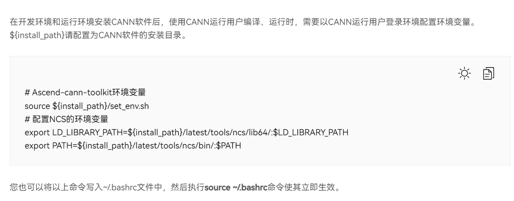
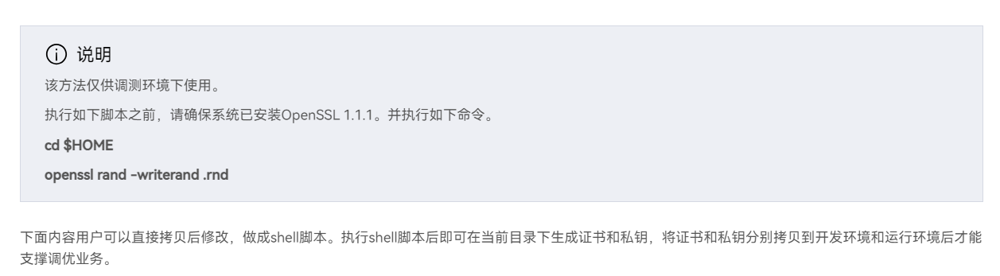
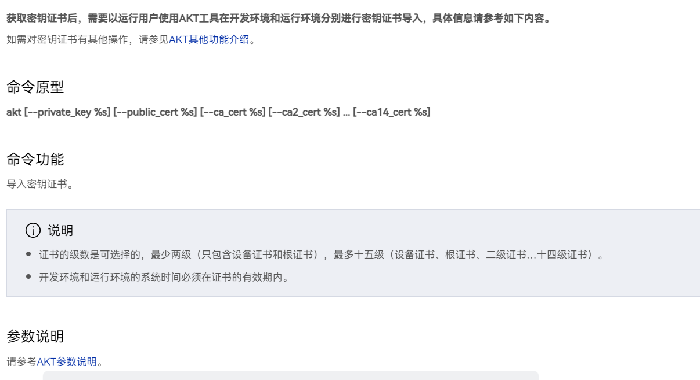
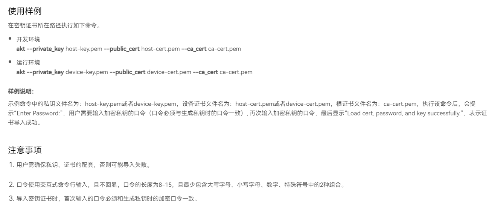
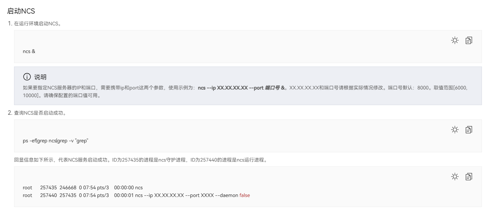
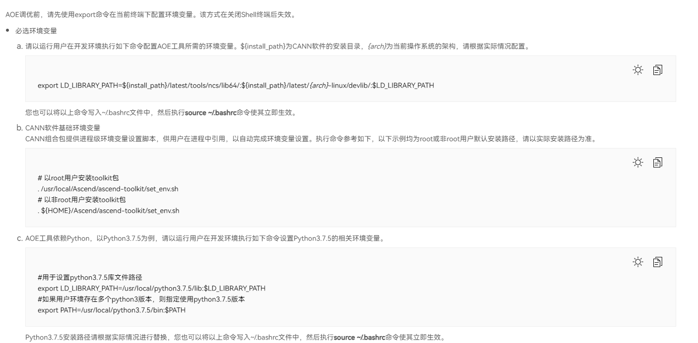

## Int8量化

### 机器要求

1. Atlas 200I DK A2（烧录有Base镜像）
2. 一台装有最新CANN Toolkit 6.2.RC1版本的Ubuntu 20.04 PC机（要求内存>=32G）(蓝区)

### DK环境准备

1. 登录DK，进入base环境，按照下图指引配置环境变量



2. 根据下图和代码（请根据注释，针对自身场景进行相应修改）完成shell脚本的编写，并运行该shell脚本（注：如选择不在DK生成密钥证书，则请确保OpenSSL版本为1.1.1）：
   


```
DEVICE_IP=10.174.229.196 # your device ip
HOST_IP=10.175.85.66 # your host ip
PASS_PHRASE=Ncx12345 # your pass phrase
KEY_LEN=3072 # [3072, 4096]
VALID_DAYS=365 # the cert will expire after the valid days
COUNTRY=CN # your country name abbr. (2 letter code)
STATE=Zhejiang # your province name
LOCATION=Hangzhou # your city name
ORGANIZATION=ABC # your company name
ORGANIZATION_UNIT=DEF # your section name
COMMON_NAME_ROOT=www.test.com # your domain name
ENCRYPT_MODE=aes256 # [aes256, aes128]

########## 该分割线以上内容请根据实际情况修改，以下内容不建议修改。##########

#generate conf
rm -rf host-ext.cnf  device-ext.cnf
echo "[ ext ]" >> host-ext.cnf
echo "subjectAltName=IP:${HOST_IP}" >> host-ext.cnf
echo "[ ext ]" >> device-ext.cnf
echo "subjectAltName=IP:${DEVICE_IP}" >> device-ext.cnf
 
#generate root cert
openssl req -x509 -newkey rsa:${KEY_LEN} -days ${VALID_DAYS} -nodes -keyout ca-key.pem -out ca-cert.pem -subj "/C=${COUNTRY}/ST=${STATE}/L=${LOCATION}/O=${ORGANIZATION}/OU=${ORGANIZATION_UNIT}/CN=${COMMON_NAME_ROOT}" -addext keyUsage=keyCertSign
 
#generate device cert request
openssl req -newkey rsa:${KEY_LEN} -nodes -keyout device-key.pem -out device-cert.csr -subj "/C=${COUNTRY}/ST=${STATE}/L=${LOCATION}/O=${ORGANIZATION}/OU=${ORGANIZATION_UNIT}/CN=NCS"
#generate device cert
openssl x509 -req -in device-cert.csr -days ${VALID_DAYS} -CA ca-cert.pem -CAkey ca-key.pem -CAcreateserial -out device-cert.pem -extensions ext -extfile device-ext.cnf
 
#generate host cert request
openssl req -newkey rsa:${KEY_LEN} -nodes -keyout host-key.pem -out host-cert.csr -subj "/C=${COUNTRY}/ST=${STATE}/L=${LOCATION}/O=${ORGANIZATION}/OU=${ORGANIZATION_UNIT}/CN=NCA"
#generate host cert
openssl x509 -req -in host-cert.csr -days ${VALID_DAYS} -CA ca-cert.pem -CAkey ca-key.pem -CAcreateserial -out host-cert.pem -extensions ext -extfile host-ext.cnf
 
#encryt private key
openssl rsa -in host-key.pem -passout pass:${PASS_PHRASE} -${ENCRYPT_MODE} -out host-key.pem
openssl rsa -in device-key.pem -passout pass:${PASS_PHRASE} -${ENCRYPT_MODE} -out device-key.pem
```

3. 使用上述shell脚本完成密钥证书的生成后，会生成相应的文件，请准备好这些文件，并根据下图方法进行导入：




4. 完成密钥证书的导入后，根据以下方法启动ncs



5. 使用`git clone https://gitee.com/HUAWEI-ASCEND/ascend-devkit.git`克隆代码仓，进入克隆到DK后的代码仓中，通过`cd src/models_adaption/Int8Quant/`进入Int8量化目录。

6. 下载Onnx模型

请使用如下obs链接[https://ascend-repo.obs.cn-east-2.myhuaweicloud.com/Atlas%20200I%20DK%20A2/DevKit/models/23.0.RC2/int8quant_models.zip]进行下载。使用`unzip int8quant_models.zip`命令进行解压。  
下载完成后，
- 将cls文件夹内的onnx模型放入模型适配工具分类输出结果文件夹edge_infer中
- 将det文件夹中的onnx模型放入模型适配工具检测输出结果文件夹infer_project中
- 将seg文件夹中的onnx模型放入模型适配工具分割输出结果文件夹edge_infer中

7. 量化前Onnx转om
   
完成Onnx模型下载后，请参考[https://www.hiascend.com/document/detail/zh/Atlas200IDKA2DeveloperKit/23.0.RC1/Application%20Development%20Guide/ttmutat/tmuacop_0001.html]文档，切换至各自的目录下，分别使用如下命令完成量化前模型的转换，为后续量化前后推理性能对比做准备（注：请参考开发者套件文档：(https://www.hiascend.com/document/detail/zh/Atlas200IDKA2DeveloperKit/23.0.RC1/pd/pd_0001.html)，在《应用开发指南章节》中，找到《转换模型》子章节，根据指导完成模型转换）：

- 分类: `atc --framework=5 --model=./MobileNetV3_large.onnx --input_format=NCHW --input_shape="image:1,3,224,224" --output=mobilenetv3_100_bs1 --log=debug --soc_version=Ascend310B1`（模型转换完成后，将转出的模型放置在DK项目目录中的cls/edge_infer目录下）
- 检测：`atc --model=./yolov5s.onnx --framework=5 --input_format=NCHW --input_shape="images:1,3,640,640" --output=yolov5s_bs1 --log=debug --soc_version=Ascend310B1 --input_fp16_nodes="images"` （完成模型转换后，在infer_project目录下，新建一个output目录，并将转换出的yolov5s_bs1.om放入该目录中）
- 分割：`atc --framework=5 --model=./model.onnx --input_format=NCHW --input_shape="actual_input_1:1,3,96,96" --output=model_bs1 --log=error --soc_version=Ascend310B1`模型转换完成后，将转出的模型放置在DK项目目录中的seg/edge_infer目录下）

8. 下载数据集

请使用如下obs链接[https://ascend-repo.obs.cn-east-2.myhuaweicloud.com/Atlas%20200I%20DK%20A2/DevKit/models/23.0.RC2/Int8QuantData.zip]进行下载，并使用命令`unzip Int8QuantData.zip`对文件夹进行解压，随后进入解压后的文件夹，将文件放入对应目录中：
- 将cls文件夹中的data目录放入模型适配工具分类输出结果文件夹edge_infer中
- 将det文件夹中的test目录放入模型适配工具检测输出结果文件夹infer_project中
- 将seg文件夹中的sample_data目录放入模型适配工具分割输出结果文件夹edge_infer中

### DK中完成Onnx模型量化

1. 从终端进入`ascend-devkit/src/models_adaption/Int8Quant`目录
2. 为模型量化安装必要的依赖：`pip install -r requirements.txt`
3. 执行量化脚本，导出Onnx量化后的模型（执行脚本前，请使用chmod给予onnx文件640权限）
- 分类：  
    `cd cls/edge_infer`  
    `python3 mobilenetv3_quant_data_label.py`  
    执行完成后，请在`edge_infer`目录中查看新生成的`MobileNetV3_large_quant.onnx`文件
- 检测：  
    `cd det/infer_project` 
    `python3 yolov5_quant_label_free.py --img_path=your_img_path` （请将一张图片的路径放入，可用上一步中下载的数据集）  
    执行完成后，请在`infer_project/output`目录中查看新生成的`yolov5s_quant.onnx`文件  
- 分割：  
    `cd seg/edge_infer`  
    `python3 unet++_quant_label_free.py --img_path=your_img_path`（请将一张图片的路径放入，可用上一步中下载的数据集）
    执行完成后，请在`edge_infer`目录中查看新生成的`model_quant.onnx`文件

### PC机准备环境

将在DK中生成的密钥与证书文件下载到PC机，并使用上述的AKT指令将密钥证书导入PC机。

参考下图，在Ubuntu PC机上完成环境变量的配置



新增：`export REPEAT_TUNE=True`

### PC机执行AOE命令进行调优

将量化后的onnx文件从dk下载至PC机中，使用如下命令完成AOE调优。

- 分类：`aoe --framework 5 --model MobileNetV3_large_quant.onnx --input_format NCHW --input_shape "image:1,3,224,224" --job_type 2 --ip 192.168.137.100 --port 8000 > log_mobilenetv3_v1.log`  
- 检测：`aoe --framework 5 --model yolov5s_quant.onnx --input_format NCHW --input_shape "image:1,3,640,640" --input_fp16_nodes="images" --job_type 2 --ip 192.168.137.100 --port 8000 > log_yolov5s.log`
- 分割：`aoe --framework 5 --model ./model_quant.onnx --input_format NCHW --input_shape "actual_input_1:1,3,96,96" --job_type 2 --ip 192.168.137.100 --port 8000 > log_unetpp.log`

我们需等待片刻，AOE即可完成执行，执行完成后，会自动生成`aoe_workspace`目录，生成的om模型在该目录下：`workspace/${model_name}_${timestamp}/tunespace/result/${model_name}_${timestamp}_tune.om`

对量化后的模型完成调优后，我们需要将上述目录的om进行改名，并上传至DK中项目的相应目录：

- 分类：改名至`mobilenetv3_quant.om`，并放入cls的`edge_infer`目录中
- 检测：改名至`yolov5s_quant.om`，并放入det的`infer_project/output`目录中
- 分割：改名至`unetpp_bs1_quant_aoe.om`，并放入seg的`edge_infer`目录中

### 对比量化前后模型的推理性能

在AOE完成调优后，本项目准备了量化前后对比的脚本。使用如下脚本，可以进行量化前后性能、和精度的对比

#### 分类：
进入`cls/edge_infer`目录下，
- 量化前性能测试：`python3 om_infer.py`
- 量化后性能测试：`python3 om_infer.py --infer_quant=True`

测试结果：
|      | 模型尺寸     | 精度损失     | 性能提升 |
| -------- | -------- | -------- | -------- | 
| 量化前 | 12M | 77.5% |5.41ms/张  |
| 量化后 | 8.87M | 82.5% | 3.86ms/张 |
| 前后对比 | +26% | +5% | +28.7% |

#### 检测：
进入`det/infer_project`目录下，
- 量化前性能测试：`python3 om_infer.py`
- 量化后性能测试：`python3 om_infer.py --infer_quant=True`

测试结果：
|      | 模型尺寸     | 精度损失     | 性能提升 |
| -------- | -------- | -------- | -------- | 
| 量化前 | 15.2M | 91.0% |18.66ms/张  |
| 量化后 | 9.1M | 88.8% | 15.17ms/张 |
| 前后对比 | +40.1% | -2.2% | +18.7% |

#### 分割：
进入`seg/edge_infer/infer/sdk`目录下，
- 量化前性能测试：`bash build.sh`
- 量化后性能测试：`bash build_after_quant.sh`

测试结果：
|      | 模型尺寸     | 精度损失     | 性能提升 |
| -------- | -------- | -------- | -------- | 
| 量化前 | 18.0M | 97,6% |9.22ms/张  |
| 量化后 | 9.6M | 97.4% | 7.84ms/张 |
| 前后对比 | +46.67% | -0.2% | +15.0% |


