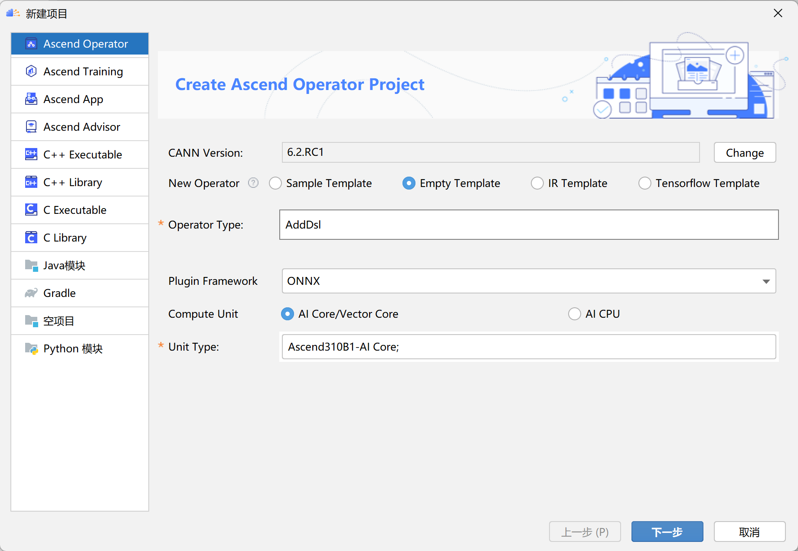
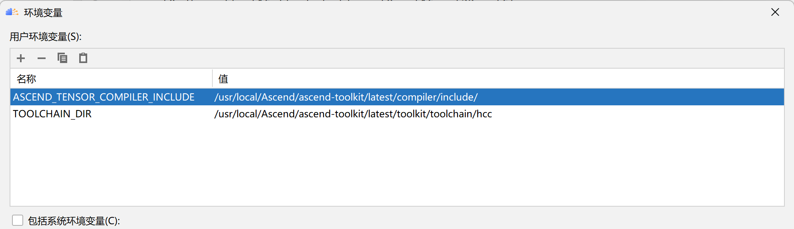

# 通过Mindstudio开发自定义算子

自定义算子开发主要由几个步骤构成：编写算子原型定义、编写算子实现、编写算子信息库、编译并部署安装包。本文将以AddDsl算子的开发为例，这是一个TBE算子。

首先启动Mindstudio，如果你还没有安装Mndstudio，请从[这里](https://www.hiascend.com/software/mindstudio/download)下载。注意，我们需要使用6.0RC1版本的Mindstudio才能与兼容A200Dk A2预装的CANN版本。  

Mindstudio需要配置SSH连接以使用A200 DK A2平台预装的CANN环境。具体操作请参考[CANN6.2文档](https://www.hiascend.com/document/detail/zh/mindstudio/60RC1/instg/instg_000030.html)中连接远程CANN工具链的部分。

在配置好CANN环境后，，点击文件->新建->项目，在弹出的界面中选择Ascend Operator，并选择empty ir。Operator Type填入自定义算子的名字，这里写AddDsl。Framework选择onnx；由于我们并不打算适配框架这里也可以任选择其他框架，但不要选择mindspore。 Unite Type选择Ai Core/Vector Core，在下拉菜单中勾中Ascend310B1即可。

完成后，点击下一步，设置好项目的保存位置即可点击完成。这里以保存在op_add_dsl目录下为例。
## 1. 编写算子原型定义
算子原型定义规定了在昇腾AI处理器上可运行算子的约束，主要体现算子的数学含义，包含定义算子输入、输出和属性信息，基本参数的校验和shape的推导。在这一步中，完成算子原型定义需要编写.h和.cc文件。算子原型定义文件位于op_proto目录下。  本文中的所有源代码都可以复制到到用户的mindstudio项目对应的文件中，最终形成与一个可运行的完整demo。  

.h文件可以配置算子的输入输出及其数据类型（即注册算子IR），.cc文件可以编写shape校验函数。.h文件的内容：
```
#ifndef GE_OP_ADD_DSL_H
#define GE_OP_ADD_DSL_H
#include "graph/operator_reg.h"
namespace ge {
    //为AddDsl算子注册算子原型定义
    REG_OP(AddDsl)
    //注册第一个输入x1,类型取值范围为Float, int32, int64, float166等等
    .INPUT(x1, TensorType({DT_FLOAT, DT_INT32, DT_INT64, DT_FLOAT16, DT_INT16,
    DT_INT8, DT_UINT8, DT_DOUBLE, DT_COMPLEX128,
    DT_COMPLEX64, DT_STRING}))
    //注册第二个输入x2
    .INPUT(x2,
    TensorType({DT_FLOAT, DT_INT32, DT_INT64, DT_FLOAT16, DT_INT16,
    DT_INT8, DT_UINT8, DT_DOUBLE, DT_COMPLEX128,
    DT_COMPLEX64, DT_STRING}))
    //注册输出y
    .OUTPUT(y,
    TensorType({DT_FLOAT, DT_INT32, DT_INT64, DT_FLOAT16, DT_INT16,
    DT_INT8, DT_UINT8, DT_DOUBLE, DT_COMPLEX128,
    DT_COMPLEX64, DT_STRING}))
    .OP_END_FACTORY_REG(AddDsl)
}

#endif //GE_OP_ADD_DSL_H
```
add_dsl.cc文件内容比较长，请读者自行参看op_proto目录下的具体实现。
## 2. 编写算子实现
自定义TBE算子，无论是DSL还是TIK类型的TBE算子，算子真正发生计算的部分都需要编写在python脚本中。算子的实现可以参考tbe/impl/add_dsl.py。
```
from __future__ import absolute_import

import tbe.dsl as tbe
from functools import reduce
from tbe import tvm
from tbe.common.register import register_op_compute
from tbe.common.utils import para_check
from tbe.common.utils import shape_util

# General limitation of the reduce size for input shape: 2**31
SHAPE_SIZE_LIMIT = 2147483648

@register_op_compute("Add", op_mode="dynamic", support_fusion=True)
def add_compute(input_x, input_y, output_z, kernel_name="add"):
    """
    calculating data's add, c = a + b

    Parameters
    ----------
    input_x: TVM tensor
        the placeholder of first input data
    input_y: TVM tensor
        the placeholder of second input data
    output_data: dict
        shape and dtype of output, should be broadcast shape and type as input
    kernel_name: str
        cce kernel name, default value is add

    Returns
    -------
    res : output of the data's add
    """
    shape_x = shape_util.shape_to_list(input_x.shape)
    shape_y = shape_util.shape_to_list(input_y.shape)

    shape_x, shape_y, shape_max = shape_util.broadcast_shapes(shape_x, shape_y,
                                                              param_name_input1="input_x",
                                                              param_name_input2="input_y")
    shape_size = reduce(lambda x, y: x * y, shape_max[:])
    if shape_size > SHAPE_SIZE_LIMIT:
        raise RuntimeError("the shape is too large to calculate")

    input_x = tbe.broadcast(input_x, shape_max)
    input_y = tbe.broadcast(input_y, shape_max)
    res = tbe.vadd(input_x, input_y)

    return res


@para_check.check_op_params(para_check.REQUIRED_INPUT, para_check.REQUIRED_INPUT,
                            para_check.REQUIRED_OUTPUT, para_check.KERNEL_NAME)
def add_dsl(input_x, input_y, output_z, kernel_name="add_dsl"):
    """
    algorithm: add
    calculating data's add, c = a + b

    Parameters
    ----------
    input_x : dict
        shape and dtype of first input, only support float16, float32, int32
    input_y : dict
        shape and dtype of second input, only support float16, float32, int32
    output_z: dict
        shape and dtype of output, should be broadcast shape and type as input
    kernel_name : str
        cce kernel name, default value is add

    Returns
    -------
    None
    """
    shape_x = input_x.get("shape")
    shape_y = input_y.get("shape")

    check_tuple = ("float16", "float32", "int32")
    input_data_type = input_x.get("dtype").lower()
    para_check.check_dtype(input_data_type, check_tuple, param_name="input_x")

    shape_x, shape_y, shape_max = shape_util.broadcast_shapes(shape_x, shape_y,
                                                              param_name_input1="input_x",
                                                              param_name_input2="input_y")

    if shape_x[-1] == 1 and shape_y[-1] == 1 and shape_max[-1] == 1:
        shape_x = shape_x if len(shape_x) == 1 else shape_x[:-1]
        shape_y = shape_y if len(shape_y) == 1 else shape_y[:-1]
        shape_max = shape_max if len(shape_max) == 1 else shape_max[:-1]

    data_x = tvm.placeholder(shape_x, name="data_1", dtype=input_data_type)
    data_y = tvm.placeholder(shape_y, name="data_2", dtype=input_data_type)

    res = add_compute(data_x, data_y, output_z, kernel_name)

    with tvm.target.cce():
        schedule = tbe.auto_schedule(res)

    config = {"name": kernel_name,
              "tensor_list": (data_x, data_y, res)}
    tbe.build(schedule, config)

```

## 3. 编写算子信息库
自定义算子的信息库文件为.ini格式的配置文件，详细内容请参考[CANN6.2]()文档相关说明。在AddDsl样例中，信息库文件内容如下，注意算子信息库文件应与算子原型定义保持一致。
```
[AddDsl]
input0.name=x1
input0.dtype=float16,float,double,int8,int16,int32,int64
input0.paramType=required
input0.format=ND,ND,ND,ND,ND,ND,ND
input1.name=x2
input1.dtype=float16,float,double,int8,int16,int32,int64
input1.paramType=required
input1.format=ND,ND,ND,ND,ND,ND,ND
output0.name=y
output0.dtype=float16,float,double,int8,int16,int32,int64
output0.paramType=required
output0.format=ND,ND,ND,ND,ND,ND,ND
opFile.value=add_dsl
opInterface.value=add_dsl

```

## 4.编译和部署
点击构建->Edit Build Configuration,配置部署选项。选项中的环境变量需要按照下图的选项设置。Toolchain选择之前配置好的CANN工具链。


如果还没有设置过Toolchain的编译配置，则需要参考[Mindstudio文档](https://www.hiascend.com/document/detail/zh/mindstudio/60RC1/msug/msug_000311.html)关于Toolchain配置的部分。对于其中的各个选项，用户应该选择Linux下的配置选项。Debugger部分可以填写为/usr/bin/gdb。

配置完成后，点击构建->build ascend operator project，等待构建完成即可。

编译完成后可以部署自定义算子到CANN算子库中。
点击Ascend->Operator Deployment，再点击operator deploy即可部署。